# GestãoProMax — Catálogo de Funcionalidades

> **Status:** documento-base para o manual do usuário final. Cada módulo descreve **o que faz**, **para que serve** e **como usar**.
> **Versão de referência:** 26/maio/2026
> **Stack:** React 19 + Vite (front) · Node + Express + Prisma + PostgreSQL (back) · Tailwind + estilos inline com 6 temas claros/escuros.

---

## Índice

1. [Visão geral](#1-visão-geral)
2. [Como entrar no sistema](#2-como-entrar-no-sistema)
3. [Perfis de acesso (papéis)](#3-perfis-de-acesso-papéis)
4. [Estrutura da tela](#4-estrutura-da-tela)
5. [Módulos por seção da sidebar](#5-módulos-por-seção-da-sidebar)
   - 5.1 [Operação](#51-operação)
   - 5.2 [Cadastros](#52-cadastros)
   - 5.3 [Estoque](#53-estoque)
   - 5.4 [Vendas & CRM](#54-vendas--crm)
   - 5.5 [Financeiro](#55-financeiro)
   - 5.6 [Atendimento](#56-atendimento)
   - 5.7 [Sistema](#57-sistema)
6. [Resiliência a falhas de rede](#6-resiliência-a-falhas-de-rede)
7. [Atalhos de teclado](#7-atalhos-de-teclado)
8. [Termos do sistema (glossário)](#8-termos-do-sistema-glossário)
9. [Operações no celular](#9-operações-no-celular)
10. [Planos e limites](#10-planos-e-limites)
11. [Perguntas frequentes](#11-perguntas-frequentes)
12. [Como usar a Ajuda no sistema](#12-como-usar-a-ajuda-no-sistema)

---

## 1. Visão geral

**GestãoProMax** é um sistema completo de gestão empresarial para micro e pequenas empresas, desenhado originalmente para uma **papelaria/copiadora** (Maxcollor Gráfica Rápida e Copiadora) mas genérico o suficiente para qualquer comércio que precise de:

- **PDV (frente de caixa)** com leitor de código de barras, controle de caixa físico e cupom;
- **Cadastros completos** de clientes (CRM), fornecedores e produtos (com tributação NF-e ready);
- **Estoque** com entradas, saídas, ajustes, inventários cíclicos e movimentações automáticas;
- **Financeiro** com contas a pagar/receber, recorrência, parcelamento e anexos de boletos;
- **CRM profissional**: funil de vendas Kanban, segmentação RFM, NPS, automações, fidelidade e lead scoring;
- **Relatórios** com exportação em PDF para todos os módulos;
- **Multi-tenant**: cada empresa opera num espaço isolado, com plano, limites e expiração próprios;
- **Multi-canal**: comandas (mesa/viagem/delivery), atendimento WhatsApp, PDV volante para garçom.

O sistema é uma **PWA** (instalável no celular) com fallback offline limitado: o carrinho do PDV é persistido localmente; vendas exigem servidor online para finalizar.

---

## 2. Como entrar no sistema


1. Abra o sistema no navegador (ou no atalho da área de trabalho/celular).
2. Digite seu **e-mail** e **senha**.
3. Se for o **primeiro acesso** com senha temporária, o sistema vai pedir uma nova senha imediatamente (modal "Trocar senha").
4. Após 5 tentativas erradas, o sistema bloqueia o e-mail por alguns minutos (rate limit).

### Credenciais de fábrica (apenas instalação nova)

- **E-mail:** `admin@gestaopro.local`
- **Senha:** `admin123`
- **Importante:** trocar essa senha imediatamente após o primeiro login.

### Esqueci a senha

Não há recuperação por e-mail pública. Peça a um **ADMIN** para resetar pela tela **Funcionários** → ações → **Trocar senha**.

### Verificação em duas etapas (2FA)

Proteção extra opcional: além da senha, o login passa a exigir um **código de 6 dígitos** gerado no seu celular (Google Authenticator, Authy, Microsoft Authenticator ou similar). Mesmo que alguém descubra sua senha, não consegue entrar.

**Como ativar:** menu do avatar (canto superior) → **🛡️ Verificação em 2 etapas** → "Ativar — gerar QR code" → escaneie o QR com o app autenticador → digite o código de 6 dígitos que apareceu no app → **Confirmar e ativar**. A ativação só completa depois de você provar um código válido — não há risco de se trancar para fora por ter fechado a janela no meio.

- **No próximo login:** após e-mail e senha, aparece o campo do código. Digite os 6 dígitos do app.
- **Trocou de celular:** entre normalmente (com o celular antigo ou antes de formatar), desative o 2FA no mesmo menu (pede sua senha) e ative de novo no aparelho novo.
- **Perdeu o celular e não está logado:** contate o suporte para liberar o acesso.
- Cada usuário ativa o seu — recomendado fortemente para **ADMIN** e contas com acesso ao financeiro.

### Limite de máquinas (dispositivos)

Cada plano permite um número de **máquinas conectadas ao mesmo tempo** (computadores/navegadores). Se você contratou 1 máquina, o sistema só abre em 1 navegador por vez.

- Ao tentar entrar numa máquina **acima do limite**, aparece a tela **"Esta conta já está em uso"** listando os dispositivos ativos.
- Para liberar o acesso na máquina nova, clique em **Desconectar** num dispositivo antigo (confirme seu e-mail/senha). Você entra automaticamente na máquina nova, e a **máquina antiga é desconectada na hora** — assim que ela faz qualquer ação volta para o login (e mesmo parada, cai sozinha em até 30 segundos).
- O identificador da máquina é guardado de forma redundante no navegador, então **limpar o histórico** normalmente **não** faz você perder a vaga. Trocar de computador, navegador ou usar uma aba anônima conta como uma máquina nova.
- O suporte (super-admin) também pode liberar máquinas pelo painel administrativo (ver seção 10).

---

## 3. Perfis de acesso (papéis)

Cada usuário tem **um papel** e uma lista de **módulos liberados**.

| Papel | O que pode fazer | Módulos típicos |
|-------|------------------|-----------------|
| **ADMIN** | Tudo. Cria/exclui usuários, troca papéis, mexe em configurações, vê logs, faz backup, reseta o sistema. | Todos (17 módulos) |
| **GERENTE** | Quase tudo, exceto gerenciar funcionários. Aprova sangrias/fechamento de caixa de vendedores. | 17 (sem Funcionários) |
| **VENDEDOR** | PDV, Caixa, Clientes, Produtos, Orçamentos, Funil, Comandas. Sem acesso a relatórios, financeiro ou compras. | 7 padrão (ajustáveis) |

> O **ADMIN nunca pode ser trancado** fora do sistema — mesmo sem permissão explícita, tem acesso total como salvaguarda.

### Editando permissões

ADMIN → **Funcionários** → clicar no funcionário → marcar/desmarcar os módulos na lista de checkboxes. A próxima vez que o usuário recarregar a página, a sidebar muda.

---

## 4. Estrutura da tela

```
┌────────────┬──────────────────────────────────────────────┐
│  SIDEBAR   │  HEADER (notificações, perfil, tema)         │
│            ├──────────────────────────────────────────────┤
│  📊 menu   │                                              │
│  📋 com    │           ÁREA PRINCIPAL                     │
│  ícones    │           (tela ativa)                       │
│  por       │                                              │
│  seção     │                                              │
│            │                                              │
└────────────┴──────────────────────────────────────────────┘
```

- **Sidebar fixa à esquerda** (240px) com 7 seções: Operação, Cadastros, Estoque, Vendas, Financeiro, Atendimento, Sistema.
- **Busca rápida de módulos (`Ctrl + K`)**: abre uma janela de busca no centro da tela para pular para qualquer módulo digitando o nome. Aceita sinônimos — buscar por *“pagar”* acha Financeiro/Despesas, *“fiado”* acha Crediário, *“nota”* acha Notas Fiscais. Navegue com `↑ ↓` e confirme com `Enter`. Atalhos: `Ctrl + K` (ou `⌘ K` no Mac) e `Alt + S`; também há o botão **🔍 Buscar** no header. Funciona em qualquer tela, inclusive no PDV em tela cheia e no celular. A busca só mostra os módulos que o seu perfil tem permissão de acessar.
- **Botão retrátil**: clique no logo para encolher a sidebar para 72px (só ícones). A preferência fica salva por usuário.
- **Mobile (≤900px)**: sidebar vira off-canvas; botão `☰` no topo abre/fecha.
- **Sino 🔔** no header abre o painel de **Alertas** (estoque baixo, contas a vencer).
- **Avatar** no header dá acesso a Aparência, Trocar Senha e Sair.
- **Tarja superior vermelha** aparece quando o sistema fica offline; **amarela** quando a internet está instável.

---

## 5. Módulos por seção da sidebar

### 5.1 Operação

#### 🛒 PDV — Ponto de Venda

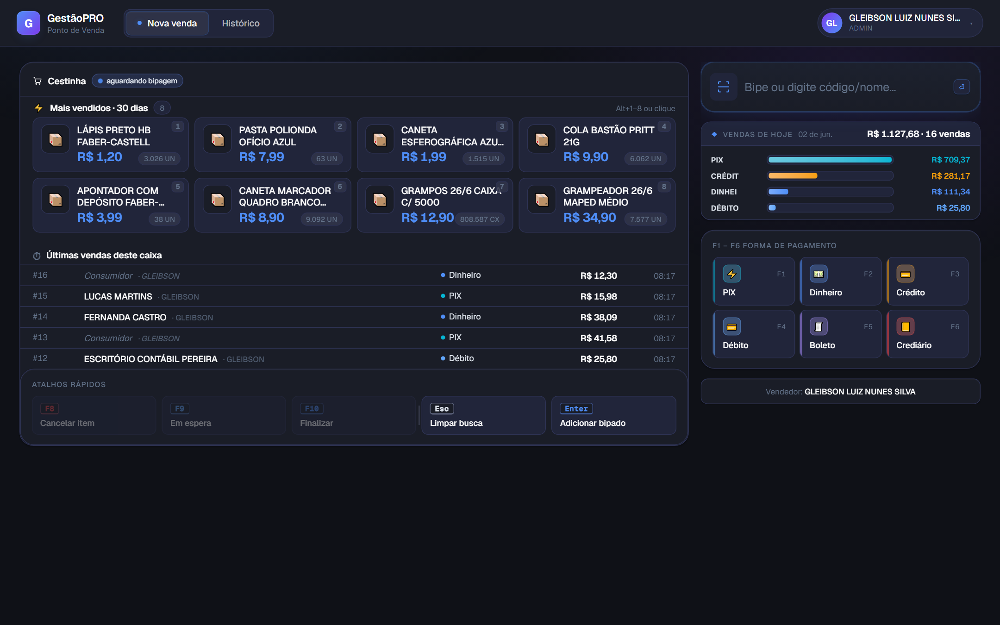

**O que faz:** registra vendas no balcão com leitor de código de barras, cliente opcional, desconto, várias formas de pagamento e cupom impresso.

**Para que serve:** é o coração do dia a dia. Toda venda começa e termina aqui.

**Como usar:**

1. **Abrir o caixa primeiro** (botão "🟢 Abrir caixa" no banner — vide [Caixa](#-caixa)). Sem caixa aberto, o botão "Finalizar venda" fica bloqueado.
2. **Bipar o produto** ou digitar código/nome no campo central. Pressione **Enter** para adicionar à cestinha (à esquerda).
3. (Opcional) selecione **cliente**, aplique **desconto** (valor ou %), troque **vendedor**.
4. Pressione **F10** ou clique em "💳 Finalizar venda".
5. No modal de pagamento, escolha a **forma de pagamento** (F1–F6 ou clique):
   - **F1** Dinheiro — pede valor recebido e calcula troco
   - **F2** PIX
   - **F3** Débito / **F4** Crédito
   - **F5** Boleto / **F6** Crediário
   - **+** Formas customizadas (criadas pelo ADMIN)
6. Para **CARTAO_CREDITO / BOLETO / CREDIARIO**, defina **vencimento** e **número de parcelas** — o sistema gera automaticamente as contas a receber.
7. Confirme. O cupom é exibido. Clique em **Imprimir** ou **WhatsApp** para enviar ao cliente.
8. O carrinho é limpo automaticamente. Próxima venda já está pronta.

**Atalhos:**
- **F1–F6** — formas de pagamento
- **F7** — alterna entre layout completo e **modo focado** (Clean)
- **F8** — modal "Cancelar item"
- **F9** — salvar atendimento em espera
- **F10** — abrir pagamento
- **Esc** — limpa campo de busca ou fecha modal
- **Setas ↑↓** — navega nas sugestões

**Modo focado (Clean):** pressione **F7** (ou clique no botão **"Focado"** no topo da tela) para trocar para um layout minimalista: a **busca/bipagem fica grande na coluna esquerda**, logo acima da cestinha expandida, e a coluna direita mostra só o **total em destaque** e os botões **F1–F6** de pagamento. Somem os números do dia, os "Mais vendidos" e as últimas vendas — ideal para horário de pico ou para operadores que se distraem com informação demais. A troca é instantânea e **não mexe na cestinha**: pode alternar no meio da venda que os itens continuam lá. A preferência fica salva no computador (cada caixa pode usar o modo que preferir). Para voltar, **F7** de novo ou botão **"Completo"**.

**Cupom impresso** traz: logo da empresa, razão social, CNPJ, endereço, itens, total, forma de pagamento, **valor recebido e troco** (quando pago em dinheiro com valor informado), vendedor, data/hora e número da venda. Vale para os dois caminhos de impressão (navegador e agente QZ Tray/Bluetooth).

**Maquininha Mercado Pago Point** (se ativada em Configurações): botão "📲 Maquininha MP" cobra direto na máquina física, com polling de aprovação a cada 2s. A venda só é criada **após** o pagamento ser aprovado pelo MP.

**Produtos vendidos por peso (kg):** cadastre o produto com **unidade KG** (ou G) e o preço por quilo em "Preço de venda". No PDV, ao adicionar esse produto abre um **teclado de balança**: o vendedor digita o **peso em gramas** (ex.: `400`) e o sistema mostra ao vivo a quantidade convertida (`0,400 kg`) e o valor calculado pelo preço/kg. Ao confirmar, a venda baixa o estoque **fracionado** (o saldo aceita até 3 casas decimais). Há atalhos de peso (100g, 250g, 500g, 1kg).

- **Etiqueta de balança:** se você usa uma balança que imprime etiqueta com código de barras (padrão Toledo/Filizola — EAN-13 começando com `2`, com o código do produto e o peso embutidos), basta **bipar a etiqueta**: o item já entra na cestinha com o peso correto, sem digitar nada. O código interno da etiqueta é casado com o **código do produto** cadastrado.

**Recuperação de rascunho:** se você fechar o navegador no meio de uma venda, ao reabrir o PDV aparece um banner azul "Você tinha N itens — Recuperar / Descartar". O carrinho é salvo a cada 600ms.

**Atendimentos em espera (salvar para depois):** está atendendo um cliente que precisou sair (foi buscar outro produto, esqueceu o cartão no carro)? Clique em **"Salvar atendimento"** (ou **F9**) no topo da cestinha. O carrinho atual é congelado e a tela fica livre para o próximo cliente.

- A espera fica salva **no servidor** e aparece para **qualquer operador** do balcão (útil em troca de turno / caixa compartilhado).
- Para retomar, clique no botão **"⏱ Em espera (N)"** no topo da cestinha → escolha o atendimento → **↩ Retomar**. Os itens, o cliente e o desconto voltam para a cestinha.
- Se você já tiver itens na cestinha ao retomar, eles são **salvos em espera automaticamente** antes — você nunca perde um atendimento ao trocar de cliente.
- Cada espera mostra nº, cliente, quantidade de itens, total, há quanto tempo foi salva e quem salvou.
- Cliente desistiu? **Descartar** (pede confirmação) remove a espera.
- Importante: a espera **não é uma venda** — não baixa estoque, não consome número de venda nem mexe no caixa. Isso só acontece quando você retoma e finaliza normalmente (F10).

**Orçamento rápido (enviar por WhatsApp / e-mail):** o cliente quer "pensar" e levar os preços anotados? Em vez de refazer tudo na tela de Orçamentos, clique em **"📄 Orçamento"** no topo da cestinha. Abre um modal com os itens do carrinho já preenchidos.

- Confirme/ajuste **nome, telefone e e-mail** do cliente (se houver um cliente selecionado na venda, esses campos já vêm preenchidos). Opcionalmente defina **validade em dias** e uma **observação** (condições de pagamento, prazo de entrega).
- Escolha o envio: **💬 WhatsApp** (abre a conversa com o resumo do orçamento já digitado), **✉️ E-mail** (abre o cliente de e-mail com assunto e corpo prontos) ou **Só salvar** (gera o orçamento sem enviar).
- Em todos os casos o orçamento é **salvo de verdade** (status *Rascunho*) e fica disponível na tela **Orçamentos** para acompanhar, aprovar e depois converter em venda.
- A **cestinha continua intacta** — gerar o orçamento é um passo de pré-venda; você pode finalizar a venda normalmente em seguida (F10) ou colocar em espera.

---

#### 🍽️ Central de Comandas

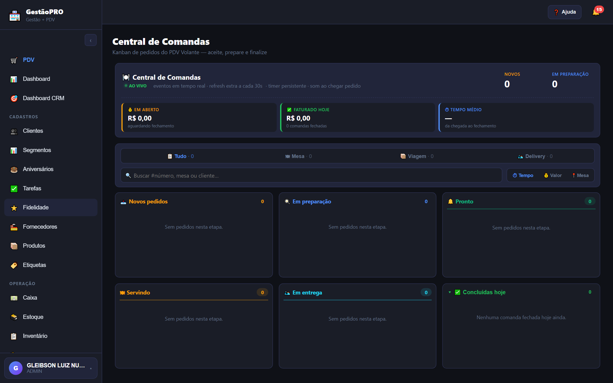

**O que faz:** painel Kanban para bar/restaurante/lanchonete. Cada comanda passa pelas etapas Novos → Em preparação → Pronto → Servindo (mesa) / Em entrega (delivery) → Concluída.

**Para que serve:** separar o **fluxo da cozinha** (produção) do **fluxo do caixa** (cobrança). A cozinha imprime o pedido; o garçom acompanha; o caixa fecha a venda.

**Como usar:**

1. Garçom abre o **PDV Volante** no celular (vide [PDV Volante](#-pdv-volante-mobile)) e cria a comanda com tipo:
   - **🍽 Mesa** — pede mesa
   - **📦 Viagem** — sem mesa, sem entrega
   - **🛵 Delivery** — pede endereço + telefone + entregador
2. Pedido aparece na **coluna Novos** do Kanban.
3. Cozinha clica **✓ Aceitar** → vai para **Em preparação**.
4. Quando pronto, clica **🔔 Pronto** → vai para **Pronto**.
5. Mesa: clica **🍽 Servir** → Servindo. Delivery: clica **🛵 Entregar** + informa entregador → **Em entrega**.
6. Para fechar, clica **💰 Fechar venda** — abre o PDV pré-preenchido com os itens da comanda.

**Adicionar itens à comanda aberta:** modal de detalhe → botão tracejado âmbar "+ Adicionar item". Imprime **cupom de adendo** (só os novos itens, marcado `*** ADENDO ***`).

**Filtros:** segmento `[📋 Tudo] [🍽 Mesa] [📦 Viagem] [🛵 Delivery]` no topo. Persiste por dispositivo.

---

#### 📲 PDV Volante (mobile)

**O que faz:** versão para celular do PDV, voltada para garçom de mesa ou tirador de pedidos.

**Como usar:**

1. No celular, fazer login e navegar até "PDV Volante" (ou abrir o app instalado).
2. Escolher tipo: **Mesa / Viagem / Delivery**.
3. Adicionar produtos (busca + qtd + observações).
4. Em **DELIVERY**, preencher endereço + telefone + entregador.
5. "Enviar pedido" → vai para a Central de Comandas como **Novo**.
6. Se a mesa já tem comanda aberta, aparece banner "🔁 Mesa X tem comanda #N aberta · + Adicionar". Permite acrescentar itens em vez de criar nova.

**Sem rede:** funciona para criar nova comanda em modo offline (salva no IndexedDB e sincroniza depois). Adicionar item a comanda existente **exige rede** (precisa do ID do backend).

---

#### 💵 Caixa

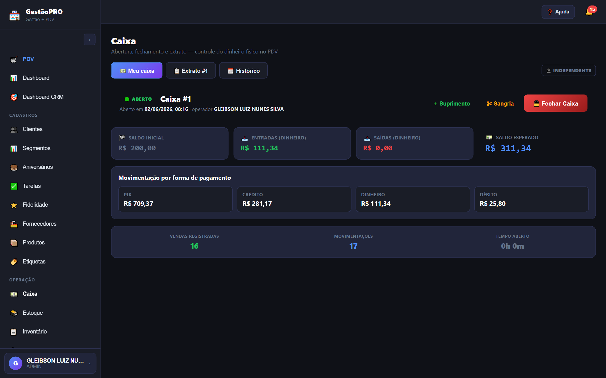

**O que faz:** controla o dinheiro físico que entra e sai do PDV no dia.

**Para que serve:** garantir que o dinheiro contado no fim do dia bate com o que o sistema esperava (conferência cega). Evita roubo, esquecimento, troco errado.

**Como usar:**

1. **Abrir caixa** (botão 🟢) — informe **saldo inicial** (o sistema sugere o "troco do dia seguinte" do último fechamento).
2. Operar normalmente no PDV. Cada venda em **DINHEIRO** soma; PIX/cartão entram no extrato mas não afetam o saldo físico.
3. Movimentações manuais (botões coloridos):
   - **🟡 Sangria** — retirar dinheiro do caixa (ex: levar pro cofre). VENDEDOR precisa de **autorização de gerente** (e-mail + senha).
   - **🟢 Suprimento** — colocar dinheiro no caixa.
4. **Fechar caixa** (conferência cega):
   - Conte o dinheiro físico.
   - Digite o valor contado **antes** de ver o esperado.
   - Informe o **troco do próximo dia** (quanto vai deixar pra começar amanhã).
   - O sistema mostra **diferença = contado − esperado**:
     - 🟢 zero = sem diferença
     - 🟡 positiva = sobra
     - 🔴 negativa = quebra

**Abas:**
- **Meu caixa** — KPIs e ações do caixa aberto
- **Extrato #N** — todas as movimentações em ordem com saldo acumulado
- **Histórico** — caixas anteriores

**Cancelamento de venda em caixa aberto** gera automaticamente um lançamento `ESTORNO_VENDA` (saída) — o saldo volta ao que era antes.

---

### 5.2 Cadastros

#### 👥 Clientes

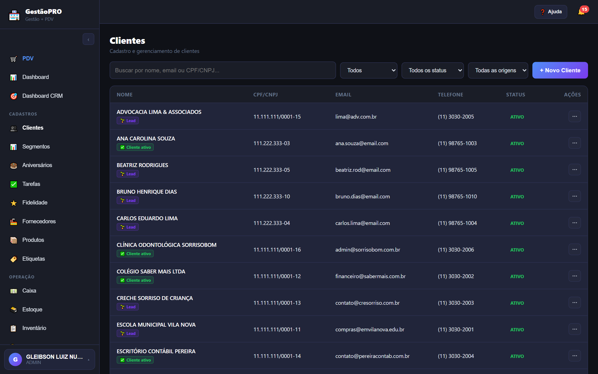

**O que faz:** cadastro de clientes (PF e PJ), com histórico de compras, segmentação RFM, score de lead, tags, contatos múltiplos (B2B), interações e tarefas.

**Para que serve:** identificar quem compra, calcular ticket médio e LTV, fazer campanhas direcionadas, gerar contas a receber em vendas a prazo.

**Como usar (cadastro):**

1. Botão **+ Novo cliente** abre modal "luxuoso" em 3 seções:
   - **Identificação** — nome (obrigatório), CPF/CNPJ (com máscara automática), tipo (PF/PJ), e-mail, telefone, data de nascimento, origem (Indicação, Instagram, Google…), status do funil (Lead, Cliente Ativo, Inativo, Perdido). **Auto-preenchimento por CNPJ:** ao digitar os 14 dígitos de um CNPJ, o sistema busca na Receita Federal (BrasilAPI) e preenche automaticamente razão social e endereço — se o documento for CPF (11 dígitos) nada é buscado. Se o CNPJ não existir ou o serviço estiver fora do ar, aparece um aviso amigável e você segue preenchendo à mão.
   - **Endereço** — CEP autocompleta via ViaCEP (rua, bairro, cidade, UF). Complemento separado.
   - **Observações** — anotações livres.
2. Salvar — barra de progresso mostra **% de preenchimento** (0-100% baseado em 10 campos).
3. Cliente vira **Lead** por padrão. Ao fazer a 1ª venda, promove automaticamente para **Cliente Ativo**.

**Tabela de clientes** exibe nome + chips de status, ações: editar, ver perfil (modal com abas: Resumo, **Linha do tempo**, Contatos B2B, Interações, Compras, Financeiro, Orçamentos), inativar (soft) ou excluir (permanente — só se não houver vendas).

**Linha do tempo (Customer 360):** aba que reúne **num único feed cronológico** tudo o que aconteceu com o cliente — vendas, orçamentos, contas a receber, interações registradas, oportunidades do funil (e suas mudanças de etapa), respostas de NPS, movimentações de pontos de fidelidade e tarefas. Cada evento mostra ícone, data/hora, responsável e valor (quando houver). Use os **chips no topo** para filtrar por tipo de evento (ex.: só Vendas, só Interações). É a visão "história completa do relacionamento" num lugar só, sem precisar abrir cada aba separadamente.

**Botões de contato** em cada linha:
- 💬 WhatsApp (abre wa.me/<telefone>)
- 📞 Ligar (tel://)
- ✉️ E-mail (mailto:)
- Dropdown de templates pré-definidos (cobrança, reativação, pós-venda etc.)

---

#### 📊 Segmentos (RFM + Lead Scoring)

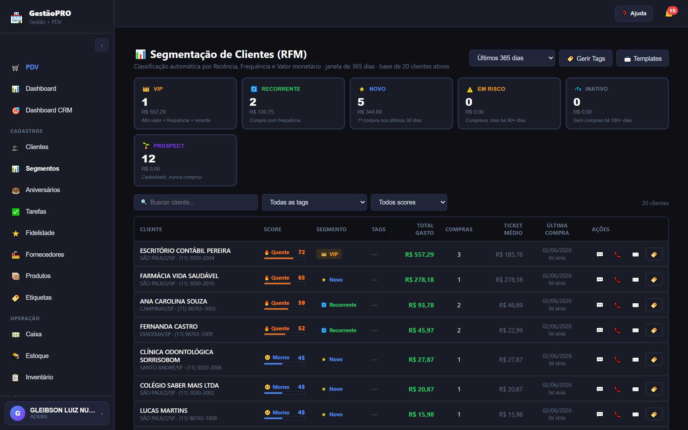

**O que faz:** classifica clientes automaticamente em 6 segmentos baseados em comportamento de compra.

**Para que serve:** identificar quem está VIP, quem está em risco de sair, quem nunca comprou — para campanhas direcionadas.

**Segmentos RFM:**

| Segmento | Quem é | Cor |
|----------|--------|-----|
| **VIP** | Compra muito e recentemente | Roxo |
| **RECORRENTE** | Compra com regularidade | Azul |
| **NOVO** | Cliente recente, ainda construindo | Verde |
| **EM_RISCO** | Comprava muito, parou | Amarelo |
| **INATIVO** | Não compra há tempo | Vermelho |
| **PROSPECT** | Cadastrado mas nunca comprou | Cinza |

**Lead Scoring (0-100):** soma Recência (35) + Frequência (25) + Monetário (25) + Bônus (NPS + tag VIP, max 15).

| Classificação | Score | Ícone |
|---------------|-------|-------|
| **VIP** | 76-100 | 🌟 |
| **QUENTE** | 51-75 | 🔥 |
| **MORNO** | 26-50 | 😐 |
| **FRIO** | 0-25 | 🥶 |

**Como usar:**

1. Janela RFM configurável (90/180/365/730 dias) no topo.
2. Cards clicáveis por segmento — filtra a tabela embaixo.
3. Coluna de score com barra colorida.
4. Botão "Gerir tags" — cria/edita tags customizadas (ex: "VIP", "Atacado", "Devedor").
5. Botão "Tags do cliente" — atribui tags a cada cliente individualmente.

---

#### 🎂 Aniversários / Reativação

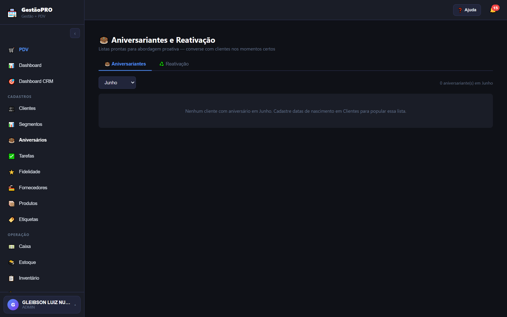

**O que faz:** lista clientes aniversariantes do mês e clientes inativos (sem comprar há X dias).

**Para que serve:** mandar parabéns no WhatsApp e tentar reativar quem sumiu.

**Como usar:**

- **Aba Aniversariantes** — filtro por mês; destaque para os aniversariantes **de hoje** (bloco laranja).
- **Aba Reativação** — KPIs (quantos sem comprar há X / LTV total em risco / LTV médio) + tabela ordenada por LTV.
- Cada linha tem botões de contato (WhatsApp, e-mail) com templates pré-formatados.

---

#### 🏭 Fornecedores

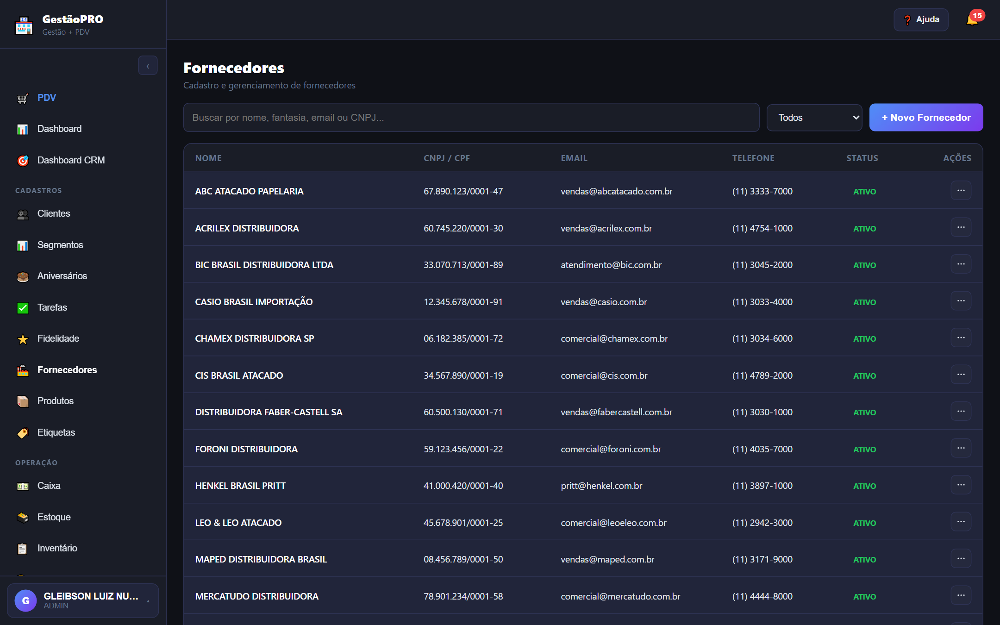

**O que faz:** cadastro de fornecedores com dados fiscais e de contato.

**Para que serve:** vincular a compras (entrada de mercadoria) e contas a pagar.

**Como usar:** mesmo padrão de Clientes (modal luxuoso, máscaras CNPJ/CEP/telefone, ViaCEP, soft-delete vs delete permanente). **Auto-preenchimento por CNPJ:** com o tipo **Pessoa Jurídica** selecionado, ao completar os 14 dígitos do CNPJ o sistema consulta a Receita Federal (BrasilAPI) e preenche razão social, nome fantasia e endereço (logradouro, número, complemento, bairro, cidade, UF, CEP e código IBGE da UF). Erros (CNPJ inexistente ou serviço indisponível) aparecem como aviso amigável abaixo do campo.

---

#### 📦 Produtos

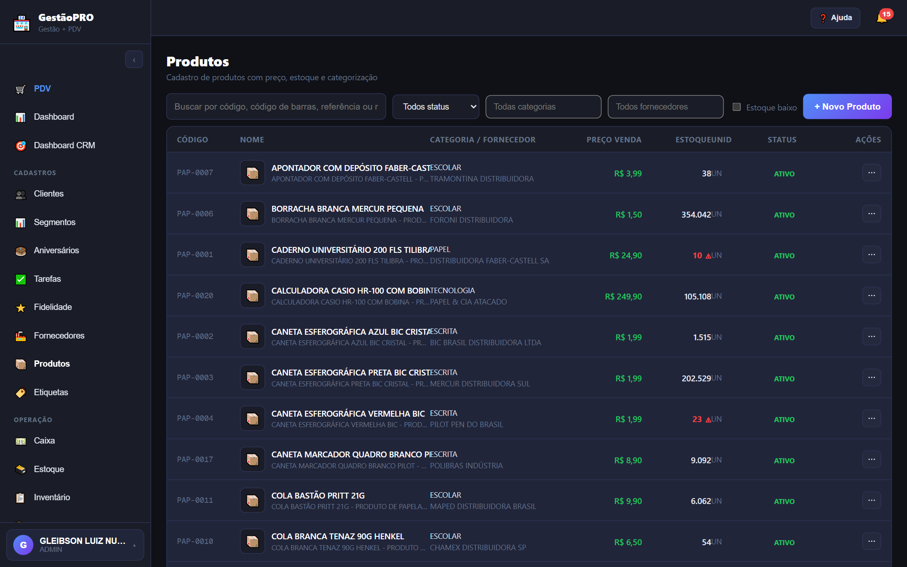

**O que faz:** cadastro do que você vende ou usa internamente.

**Para que serve:** alimentar PDV, estoque, compras, orçamentos, etiquetas.

**Tipos de item:**

- **📦 PRODUTO** — físico, com estoque. Cai em alertas se zerar.
- **🛠 SERVIÇO** — impressão, encadernação, taxa de boleto. Sem estoque. Sempre disponível. Não aparece em alertas.

**Identificadores (qualquer um vale no PDV):**

- **Código interno** (obrigatório, único)
- **Código de barras / EAN** (opcional, único quando preenchido)
- **Referência** (livre, código do fornecedor)
- **Fabricante / Marca** (opcional, cadastro reutilizável — ex.: BIC, Faber-Castell, Bosch)
- **Nome** (busca por trecho)

**Como usar (form em 5 seções):**

1. **Identificação** — código (sugestão automática), nome, descrição, código de barras, referência, fabricante/marca. O **Fabricante / Marca** é um cadastro reutilizável: selecione um já existente na busca ou clique no botão **+ Novo** ao lado para cadastrar um novo sem sair da tela — ele já fica selecionado e disponível para os próximos produtos.
2. **Imagem** — dropzone (arraste ou clique). Até 2 MB, JPG/PNG/WebP.
3. **Tipo do item** — radio cards Produto/Serviço.
4. **Preços e estoque** — preço de custo, cálculo de markup, preço de venda, estoque atual, estoque mínimo, **unidade**. A unidade é um **menu de seleção** com as unidades já pré-cadastradas (UN, KG, G, L, ML, M, M², CX, PCT, PAR, DZ, KIT…), evitando erro de digitação que poderia divergir o estoque ou ser rejeitado na NF-e. Na aba **Tributação / NF-e** há também a **unidade tributável** (mesmo menu; deixe em branco para usar a comercial).
5. **Categorização** — categoria (cria inline se não existir), fornecedor padrão, tributação fiscal (NCM, CEST, CFOP, Origem, CST/CSOSN, PIS, COFINS, cBenef).

**Preenchimento assistido da tributação (NF-e):** a aba **Tributação / NF-e** ajuda a evitar erro de digitação fiscal:
- **NCM validado online** — ao sair do campo NCM (8 dígitos), o sistema consulta a tabela oficial e mostra a **descrição** do código logo abaixo (✓ verde quando válido, ✕ vermelho quando o NCM não existe). É só conferência — o valor digitado é mantido.
- **Padrões por regime** — ao escolher o **Regime tributário do item** (Simples Nacional / Regime Normal), os campos **CSOSN ou CST do ICMS, CFOP e CST de PIS/COFINS** são preenchidos com os valores mais comuns daquele regime (ex.: Simples → CSOSN 102, CFOP 5102). **Só preenche o que estiver vazio** — nunca sobrescreve o que você já digitou. As **alíquotas** de PIS/COFINS não são sugeridas porque dependem do enquadramento (Lucro Presumido × Real); confirme com seu contador. O **CEST** continua manual (só se aplica a produtos com Substituição Tributária).

**Cálculo de markup** — fica recolhido por padrão (clique em **🧮 Calculadora de markup / formação de preço** para abrir, deixando a aba *Dados Gerais* mais enxuta). Dois jeitos de chegar ao preço de venda:
- **Margem sobre o custo** — digite a margem desejada (ex.: 120%) e o preço de venda é calculado na hora como `custo × (1 + margem%)` (custo 10,00 + 120% = 22,00). É bidirecional: se você digitar o preço de venda direto, o campo de margem mostra automaticamente qual margem aquele preço representa.
- **Formação de preço (margem sobre a venda)** — informe impostos sobre venda, taxas de cartão e a margem desejada; o sistema sugere o preço "por dentro" (`custo ÷ (1 − soma%)`) e o botão **Aplicar ao preço de venda** preenche o campo. Como a margem aqui é sobre a venda, a soma dos percentuais precisa ser menor que 100%.

**Lista:** miniatura, badges (`SERVIÇO`, `📊 EAN`, `🏷 REF`), unidade, estoque atual (com cor: verde > mínimo, amarelo = mínimo, vermelho < mínimo, ♾ se serviço), botão **📊 Movimentar estoque**.

**Busca:** placeholder "Buscar por código, código de barras, referência ou nome…"

**Inativar / Reativar um produto:** inativar é a forma correta de "tirar de circulação" um produto sem apagar o histórico — ele some das buscas do PDV (não pode mais ser vendido), mas as vendas antigas continuam intactas. Há duas formas:

- **Na lista:** clique no botão **`···`** (coluna *Ações*, à direita da linha) → **⊘ Inativar** (ou **↻ Reativar** se já estiver inativo) → confirme.
- **Dentro do cadastro:** ao **editar** um produto, há o botão **⊘ Inativar produto** (ou **↻ Reativar produto**) no canto inferior esquerdo do formulário, ao lado de Cancelar/Salvar.

O status alterna entre **ATIVO** (verde) e **INATIVO** (cinza). Use o filtro **"Todos status" → "Apenas inativos"** no topo da tela para listar os inativos.

> Inativar/reativar pode ser feito por **ADMIN** e **GERENTE** (mesmos perfis que editam produtos). Não há exclusão permanente de produto: "inativar" é um soft-delete que preserva todo o histórico de vendas, compras e estoque.

**Histórico de compras de um produto:** ao **editar** um produto físico, o botão **🚚 Histórico de compras** (no canto inferior esquerdo do formulário, ao lado de *Inativar produto*) abre uma janela com **todas as entradas de compra daquele produto por fornecedor**: data, número da compra, fornecedor, quantidade, custo unitário e subtotal. No topo há um resumo — quantas compras, quantidade total comprada, total gasto, **custo médio** e o **último custo** (com a data e o fornecedor). Compras estornadas aparecem marcadas como **ESTORNADA** e não entram no resumo (o estorno já reverteu a entrada). Serviços não têm esse botão (não entram em compras).

---

#### 🏷️ Etiquetas

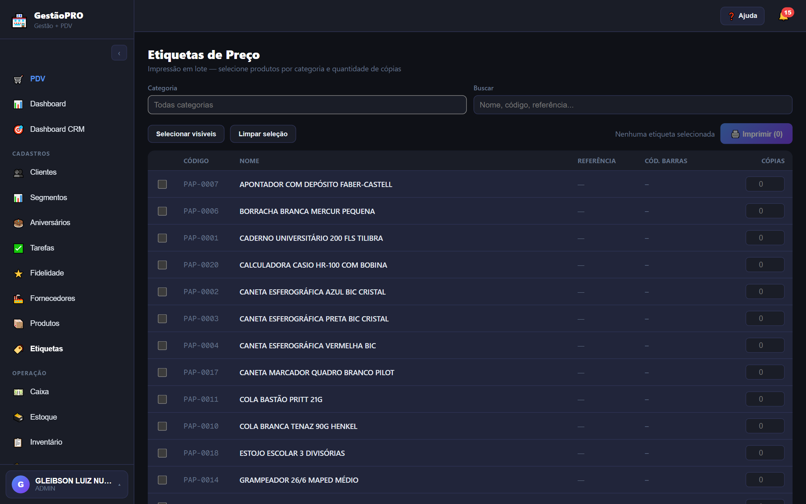

**O que faz:** monta e imprime etiquetas de preço de **60×40mm** em lote, em folha **A4** (3 colunas × 7 linhas = **21 etiquetas por folha**). Cada etiqueta traz código, referência, nome, preço de venda em destaque e código de barras.

**Para que serve:** colar nos produtos da loja / na prateleira. Só aparecem **produtos** ativos — serviços ficam de fora (etiqueta física não faz sentido para serviço).

**Como usar:**

1. **Filtre** por categoria e/ou use a **busca** (nome, código, referência ou código de barras).
2. **Marque** os produtos. Use **✓ Selecionar visíveis** para marcar todos os filtrados de uma vez.
3. Defina as **cópias** de cada item nos botões **− / +** (ou digite a quantidade). Marcar um produto já entra com 1 cópia.
4. Acompanhe no painel da direita: a **prévia ao vivo** da etiqueta (mostra o último produto marcado) e o resumo do trabalho — **Produtos**, **Etiquetas** e **Folhas A4** (calculado automaticamente).
5. Clique em **🖨️ Imprimir** — abre a caixa de impressão do navegador já com as etiquetas montadas. Use **Limpar tudo** para recomeçar.

> **Dica de impressão:** na caixa do navegador, deixe as **margens em "Padrão"** e **desative cabeçalho/rodapé** para o alinhamento das etiquetas ficar correto. Confira na pré-visualização antes de imprimir.

---

### 5.3 Estoque

#### 🗃️ Estoque

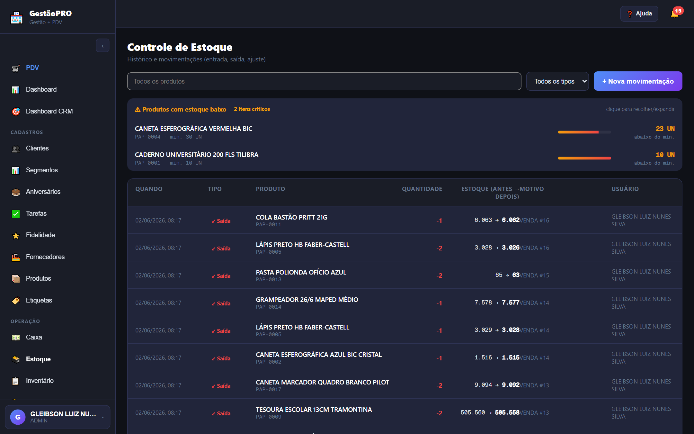

**O que faz:** controle de entradas, saídas e ajustes manuais por produto.

**Para que serve:** rastrear movimentações fora das vendas/compras (ex: perda, doação, transferência).

**Como usar:**

1. Botão **+ Nova movimentação**.
2. Tipo: **ENTRADA / SAIDA / AJUSTE**.
3. Produto, quantidade, motivo (texto livre).
4. Salvar — o estoque do produto é atualizado automaticamente e a movimentação fica registrada em ordem cronológica.

**Movimentações automáticas (não manuais):**
- Venda no PDV gera SAIDA
- Compra gera ENTRADA
- Cancelamento de venda gera ENTRADA de estorno
- Estorno de compra gera SAIDA de estorno

**Filtros:** tipo, produto, período.

**Produtos com estoque baixo:** no topo da tela há um painel (recolhível) listando os produtos físicos **ativos** com estoque no/abaixo do mínimo — código, mínimo, barra de nível e quantidade atual (vermelho = esgotado, amarelo = abaixo do mínimo). Produtos **inativos** não aparecem, então **inative os itens descontinuados** (que você passou a comprar de outra marca) para tirá-los da lista.

---

#### 📋 Inventário

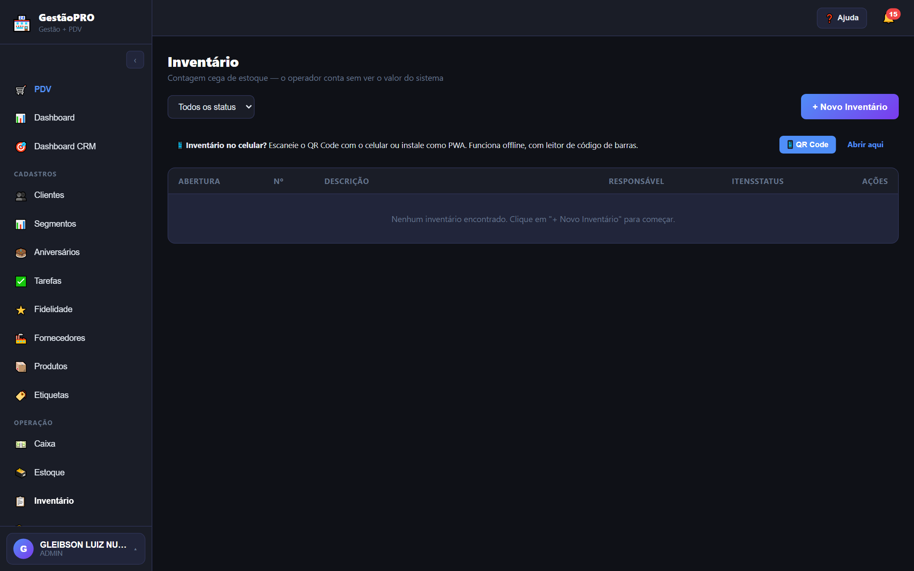

**O que faz:** contagem cíclica de estoque com 3 telas (lista, contagem, detalhe).

**Para que serve:** auditar o estoque físico contra o sistema (geralmente 1x/mês).

**Como usar:**

1. **Criar inventário** — escolhe categoria(s) ou produtos específicos.
2. Sistema gera lista a contar.
3. **Aba Contagem** — para cada produto, conta no físico e digita. Pode ser feito no celular (versão mobile dedicada).
4. **Aba Detalhe** — vê divergências (sistema vs contado) e pode aprovar ajuste automático em massa.
5. Após aprovar, gera **MovimentacaoEstoque AJUSTE** para cada divergência.

---

### 5.4 Vendas & CRM

#### 🛍️ Compras

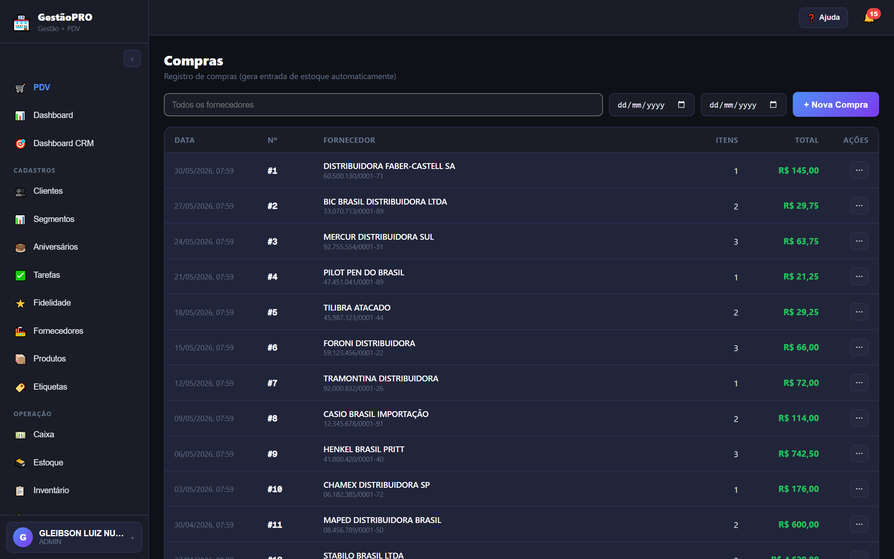

**O que faz:** registra entrada de mercadoria do fornecedor.

**Para que serve:** atualizar estoque automaticamente e gerar conta a pagar.

**Como usar:**

1. **+ Nova compra** → fornecedor → adicionar itens (busca produto, qtd, custo unitário).
   - **Dica de teclado:** ao terminar o **preço** do último item, aperte **Tab** que já abre a próxima linha com o foco no campo de produto — dá pra lançar a nota inteira sem tirar a mão do teclado.
2. **Subtotal** somado automaticamente. Há um campo **Desconto de ajuste** (R$) para abater bonificações/acertos do fornecedor; o **Total da compra** = subtotal − desconto, e é esse valor líquido que vira conta a pagar.
3. **💾 Salvar rascunho** (rodapé): guarda a compra pela metade **neste dispositivo** para retomar depois. Os rascunhos aparecem numa faixa no topo da tela de Compras com **Retomar** / **Descartar**. Ao **Registrar** uma compra retomada, o rascunho some sozinho. (É local ao navegador — não fica compartilhado entre dispositivos.)
4. Bloco verde **"💰 Gerar conta a pagar"** (ligado por padrão):
   - Vencimento (default: hoje + 30 dias)
   - Parcelas (1× à vista até 12×)
   - Preview: "✓ 3× R$ 100,00 — vencendo no dia 15 de cada mês a partir de 15/06/2026"
5. **Registrar** — em uma transação, cria: compra + ENTRADA no estoque para cada item + N contas a pagar com `grupoRecorrenciaId` compartilhado.

**Estornar compra:** detalhe → botão "↩ Estornar". Pede motivo. Reverte estoque (SAIDA), cancela contas pendentes. Bloqueia se houver conta já paga (precisa reabrir no Financeiro primeiro).

---

#### 🧮 Sugestões de Compra

**O que faz:** monta a lista de reposição de estoque — o que precisa ser comprado.

**Para que serve:** nunca deixar faltar produto. O sistema avisa o que está acabando e você gera o pedido de compra com poucos cliques.

**De onde vêm os itens:**

- **Sugestão do sistema (badge azul "Sistema"):** todo produto ativo cujo **estoque ≤ estoque mínimo** aparece automaticamente. A faixa vermelha na lateral da linha indica urgência. *Configure o **estoque mínimo** no cadastro do produto* (aba principal) para o produto entrar nesse radar — sem mínimo definido, ele não é sugerido automaticamente.
- **Adição manual (badge roxo "Manual"):** use a busca no topo (**"Adicionar produto manualmente"**) para antecipar uma compra mesmo que o estoque esteja acima do mínimo (ex.: vai entrar em promoção, sazonalidade). Informe a quantidade ou deixe **auto**.

**Como usar:**

1. A coluna **Qtd a comprar** já vem com uma sugestão (repor até ~2× o mínimo). Ajuste à vontade — o valor é salvo ao sair do campo.
2. Marque os itens que vai comprar (caixa de seleção; o cabeçalho marca/desmarca todos). O rodapé mostra **quantos itens** e a **estimativa de custo** (pelo custo cadastrado).
3. Com itens marcados, aparecem **dois botões** — escolha conforme a situação:
   - **📄 Imprimir Pedido (PDF):** gera um PDF para **imprimir e levar ao fornecedor** (ex.: você se desloca até o atacadista). **Não altera estoque nem financeiro** — é só o documento de compra. Vem **agrupado por fornecedor (uma página por fornecedor)** com código, produto, estoque atual, quantidade e o último custo como referência; as colunas **Preço** e **Total ficam em branco** para preencher na hora da negociação, além de linhas de assinatura (Comprador / Fornecedor). Itens sem fornecedor definido saem numa folha "Fornecedor a definir".
   - **🛍️ Gerar Pedido de Compra:** quando a mercadoria já chegou (ou você compra e recebe na hora) → abre a tela de **Nova Compra** já preenchida com os itens (e o fornecedor, se todos compartilham o mesmo). A partir daí é o fluxo normal: confirma fornecedor, custos e conta a pagar — e **aí sim** atualiza o estoque.
4. Após registrar a compra (botão 🛍️), o sistema pergunta: **🧹 Limpar da lista** (remove os itens) ou **📌 Manter** (útil quando você vai comprar de mais de um fornecedor). As sugestões automáticas somem sozinhas quando o estoque é reposto pela compra.

**Dispensar / remover:** o **×** na linha dispensa uma sugestão do sistema (ela volta se o estoque cair de novo) ou remove um item manual de vez. Filtro **"Só abaixo do mínimo"** esconde os itens manuais que estão com estoque ok.

> Faz parte do módulo **Compras** (mesma permissão/plano). Visualização para quem tem acesso a Compras; montar a lista e gerar pedido é para Admin/Gerente.

---

#### 📝 Orçamentos

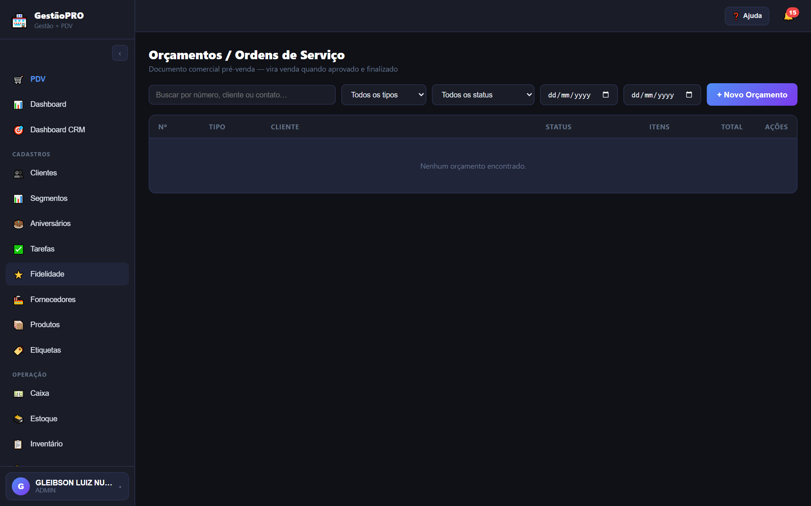

**O que faz:** monta uma pré-venda com validade para o cliente decidir depois.

**Para que serve:** pedidos grandes, orçamentos por e-mail, propostas.

**Como usar:**

1. + Novo orçamento → cliente + itens + validade (dias).
2. Status: **ABERTO → ACEITO → CONVERTIDO em venda** (botão "Converter em venda" abre o PDV pré-preenchido) ou **RECUSADO / EXPIRADO**.
3. Pode anexar PDF/imagens.
4. Botão "WhatsApp" envia link/texto formatado.

**Aceite online (cliente aprova pela internet):** no detalhe do orçamento, clique em **🔗 Link de aprovação**. O sistema:

- Gera um **link público** (e o copia para a área de transferência); se o orçamento estava em *Rascunho*, ele sobe automaticamente para *Aguardando aprovação*.
- Mostra o link num campo para copiar manualmente e, se o cliente tem telefone, um botão **💬 Enviar** que abre o WhatsApp com a mensagem pronta.
- O cliente abre o link **sem precisar logar** (rota pública `?orc=<token>`): vê os itens, totais e condições, e clica em **✅ Aprovar** ou **Recusar** (pode informar o motivo).
- A resposta volta para o sistema na hora — o orçamento passa a **Aprovado** (com data) ou **Rejeitado** (com motivo). Cada link só pode ser respondido **uma vez**.

---

#### 🎯 Funil de Vendas

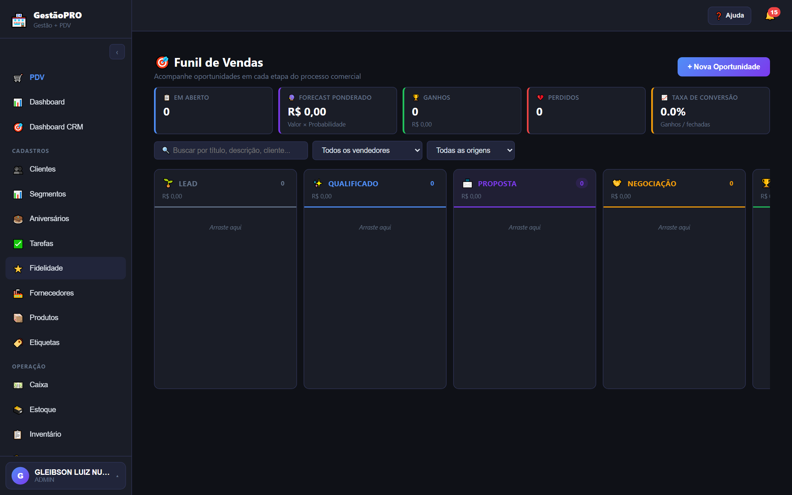

**O que faz:** Kanban de oportunidades comerciais em 6 etapas: LEAD → QUALIFICADO → PROPOSTA → NEGOCIAÇÃO → GANHO / PERDIDO.

**Para que serve:** acompanhar leads desde o primeiro contato até o fechamento.

**Como usar:**

1. **+ Nova oportunidade** → cliente + título + valor + etapa inicial.
2. **Arrastar** o card entre colunas para mudar de etapa (drag & drop).
3. Ao mover para **PERDIDO**, sistema **obriga informar motivo** (preço, prazo, concorrente etc.) — vira fonte de relatório.
4. Atalho **"✨ Usar exemplo"** preenche os campos com um caso fictício para testar.

**Cores das colunas:** cinza/azul/roxo/laranja/verde/vermelho.

**Forecast ponderado (valor × probabilidade):** cada oportunidade tem uma **probabilidade (%)** de fechar. Se você deixar o campo em branco ao criar/mover, o sistema usa um padrão por etapa (Lead 10% · Qualificado 30% · Proposta 50% · Negociação 75% · Ganho 100%). O **valor ponderado** = valor estimado × probabilidade dá uma previsão realista de quanto o funil deve gerar:
- No topo da tela, o KPI **🔮 Forecast ponderado** soma o ponderado de todas as etapas em aberto.
- No cabeçalho de cada coluna aparece, ao lado do valor bruto, o **🔮 ponderado daquela etapa** (só nas etapas em aberto).
- Cada card mostra `probabilidade% · valor ponderado`.

**Dashboard CRM** consome esses dados para taxa de conversão etapa-a-etapa e exibe o mesmo **🔮 forecast ponderado** por etapa.

---

#### ⚡ Automações

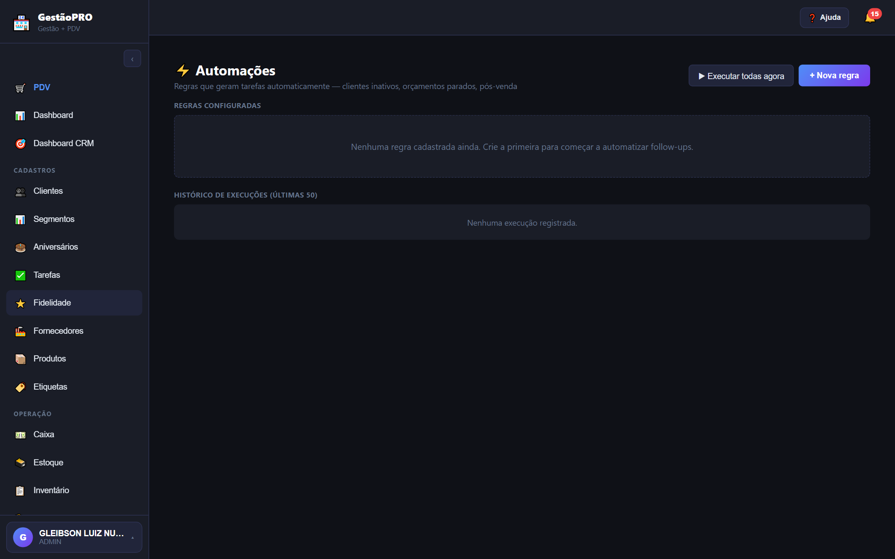

**O que faz:** dispara tarefas automaticamente conforme regras.

**Tipos suportados:**

- **CLIENTE_INATIVO** — sem comprar há N dias → gera tarefa "Reativar fulano (90 dias sem comprar)"
- **ORCAMENTO_PARADO** — orçamento aberto há N dias sem resposta → tarefa de follow-up
- **POS_VENDA_FOLLOWUP** — N dias após venda → tarefa "Perguntar se gostou + pesquisa NPS"

**Como usar:**

1. **+ Nova regra** → nome, tipo, dias-gatilho, template de título da tarefa (com variáveis `{{nomeCliente}}`, `{{valorVenda}}` etc.).
2. **Botão "✨ Usar exemplo"** preenche um exemplo.
3. Salvar → fica ativa. Backend roda diariamente (cron externo).
4. **Botão "Executar agora"** dispara manualmente para teste.
5. **Histórico** mostra últimas 50 execuções (cliente afetado, tarefa criada, erro se houver).

**Anti-duplicação:** o sistema nunca cria 2 tarefas idênticas para o mesmo contexto (cliente+regra ou venda+regra).

---

#### ⭐ NPS pós-venda

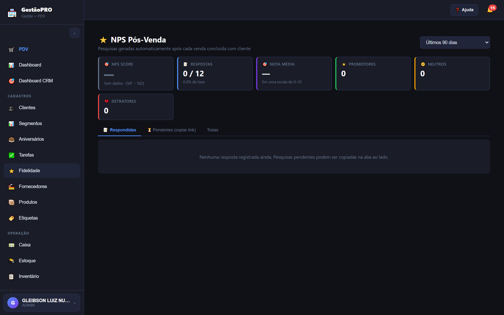

**O que faz:** pesquisa de satisfação enviada ao cliente após cada venda.

**Para que serve:** medir lealdade (NPS = % Promotores − % Detratores) e identificar pontos de melhoria.

**Como usar:**

1. Cliente compra → sistema gera pesquisa com **token único** automaticamente.
2. Vendedor envia link no WhatsApp pelo botão na tela NPS.
3. Cliente abre o link **sem precisar fazer login** (rota pública `?nps=<token>`):
   - Escolhe nota de **0 a 10** (escala visual colorida).
   - Comentário opcional.
   - Confirma.
4. **Dashboard NPS** mostra: KPIs, barra empilhada (detratores/neutros/promotores), 3 abas (Respondidas / Pendentes / Todas).

**Classificação NPS:**

| Nota | Categoria | Cor |
|------|-----------|-----|
| 0-6 | Detrator | Vermelho |
| 7-8 | Neutro | Amarelo |
| 9-10 | Promotor | Verde |

---

#### 🎯 Dashboard CRM

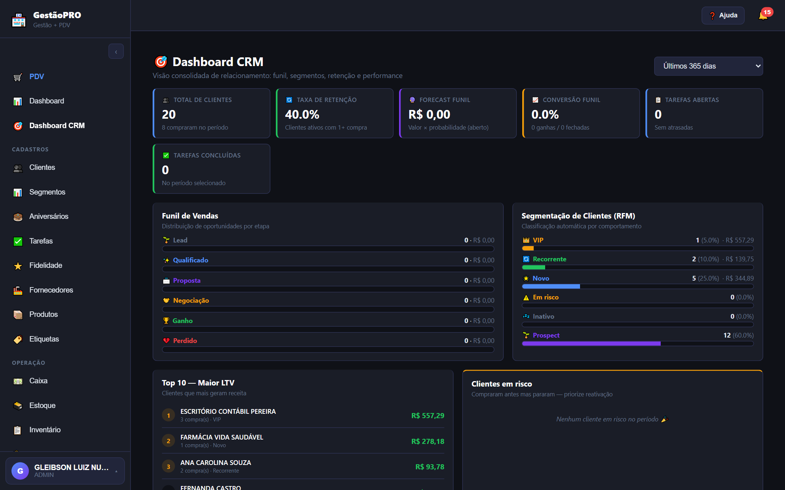

**O que faz:** consolida funil + segmentos + LTV + tarefas + NPS + performance comercial numa tela só.

**Para que serve:** visão de gestão comercial em tempo real.

**Como usar:**

- Filtro de janela (7/30/90/365 dias) no topo.
- 6 KPIs (oportunidades abertas, taxa de conversão, ticket médio, valor em risco, NPS score, vendas no período).
- Funil em barras horizontais.
- Segmentos com %.
- Top 10 LTV + Top 10 em risco lado a lado.
- Tabela de performance por vendedor.

---

#### ✅ Tarefas

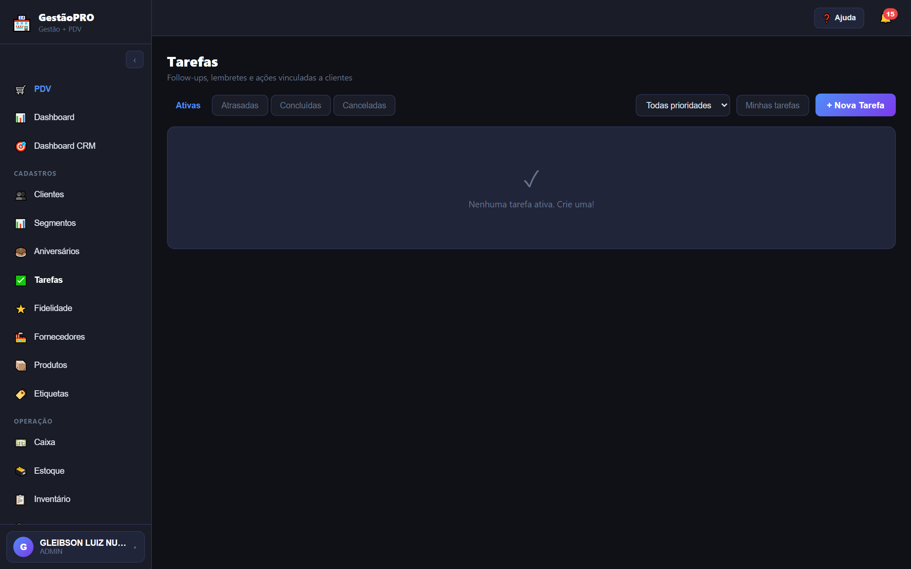

**O que faz:** lista de tarefas com cliente vinculado, prazo, prioridade e responsável.

**Para que serve:** cobranças, follow-ups, lembretes — manuais ou geradas por automações.

**Como usar:**

1. **+ Nova tarefa** → título, cliente (opcional), responsável, prazo, prioridade.
2. Visualizações: **Hoje / Atrasadas / Futuras / Concluídas**.
3. Marcar como concluída → vai para o histórico.

---

#### 🏆 Fidelidade

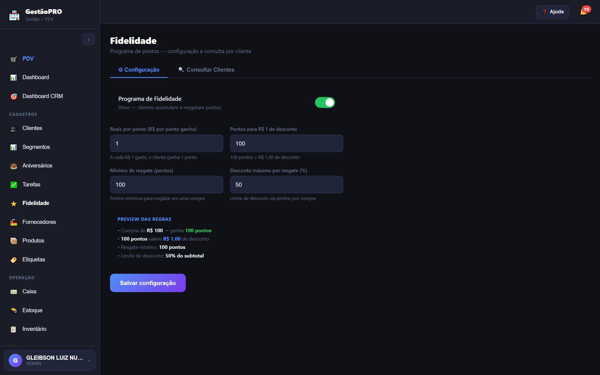

**O que faz:** pontos por compra + resgate por desconto.

**Para que serve:** programa de fidelidade simples para reter clientes.

**Como usar:**

1. ADMIN configura a regra: "R$ X gastos = 1 ponto" e "Y pontos = R$ Z de desconto".
2. Cliente vinculado a venda acumula pontos automaticamente.
3. No PDV, antes de fechar, operador pode **resgatar pontos** como desconto.

---

#### 🏆 Comissões

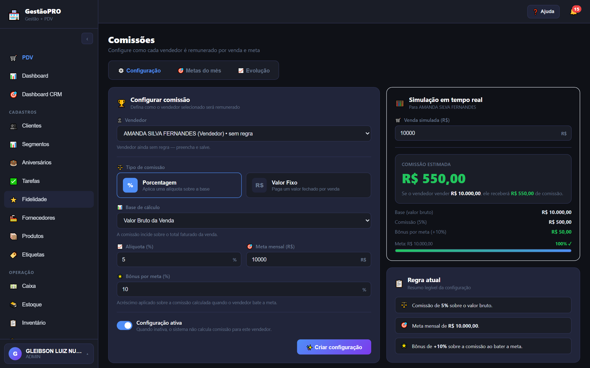

**O que faz:** calcula comissão do vendedor por venda.

**Para que serve:** apurar a folha de pagamento variável.

**Como usar:**

1. ADMIN/GERENTE define a regra (% sobre faturamento ou margem) em **Sistema → Configurações de Comissão**.
2. Cada venda registra o vendedor.
3. Tela mostra ranking por período + valor total a pagar.

**Abas da tela:**

- **⚙️ Configuração** — regra de comissão, **meta mensal** e bônus por meta de cada vendedor.
- **🎯 Metas do mês** — acompanhamento da meta no mês corrente (ou em meses anteriores, pelo seletor):
  - **Resumo da equipe**: meta total, realizado, % de atingimento e quantos vendedores já bateram.
  - **Ranking** (🥇🥈🥉) por % de atingimento, com **barra de progresso** por vendedor.
  - **Pacing (projeção pelo ritmo)**: no mês corrente, um marcador branco na barra mostra onde o vendedor vai chegar se mantiver o ritmo atual; o sistema indica **quanto falta** e **quanto precisa vender por dia** para bater a meta.
  - **Status**: 🏆 Meta batida · ✅ No ritmo · ⚠️ Atenção · 🔴 Atrasado.
  - Só aparecem vendedores com **meta mensal configurada** (> 0) na aba Configuração.
- **📈 Evolução** — série histórica de comissões por vendedor (gráfico).

---

### 5.5 Financeiro

#### 💰 Financeiro

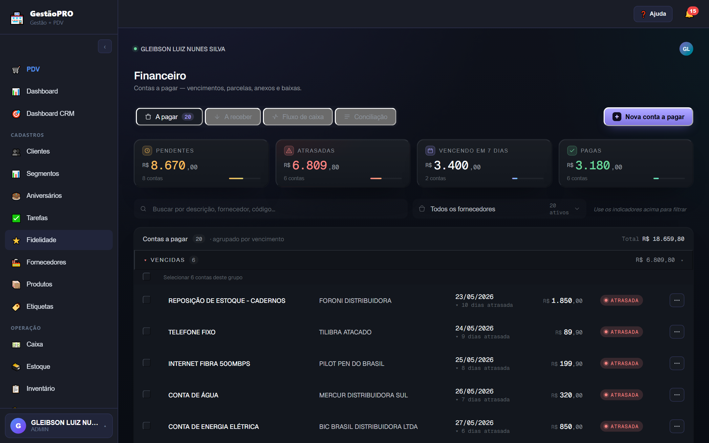

**O que faz:** gestão de **Contas a Pagar** (CP) e **Contas a Receber** (CR) com pagamentos parciais, recorrência, anexos e ações em lote.

**Para que serve:** controlar fluxo de caixa, prever inadimplência, fechar mês.

**Como usar:**

**Abas:** 💸 Contas a Pagar | 💰 Contas a Receber

**KPIs interativos no topo** — clique para filtrar a tabela:
- 📋 Pendentes
- ⏰ Atrasadas
- 🔔 Vencendo em 7 dias (cliente-side)
- ✅ Pagas/Recebidas

**Tabela agrupada em buckets dinâmicos:**

- 🔴 **Vencidas**
- 🟡 **Vence hoje**
- 🟠 **Esta semana**
- 🔵 **Próximas 30 dias**
- ⚪ **Futuras**
- ✅ **Concluídas** (colapsado por padrão)

Cada grupo tem header colapsável com contagem + subtotal.

**Ações por linha:**
- Pagar/Receber (parcial ou total — escolhe forma de pagamento; cria movimentação no Caixa se aberto)
- **Gerar boleto (Asaas)** — só em **Contas a Receber** em aberto com cliente vinculado (ver abaixo)
- Cancelar (com motivo)
- Reabrir (se já paga)
- Anexar PDF/imagem do boleto (até 5 MB)
- Editar / Excluir

**Ações em lote:** marcar checkbox de várias contas → barra flutuante mostra "X selecionadas · R$ Y" → botões "Pagar selecionadas" / "Cancelar contas".

**Categoria (obrigatória nas Contas a Pagar):** ao criar uma conta a pagar, escolha a **Categoria** — são as mesmas categorias do **Plano de Contas** usadas em Despesas. Isso classifica o gasto desde o nascimento da conta e alimenta o relatório **Previsto × Realizado** (em Despesas) e a exportação do contador. Em contas **parceladas/recorrentes**, a categoria é aplicada a todas as parcelas.

**Recorrência:** ao criar conta, marque **PARCELADA** (gera N contas mês a mês com `grupoRecorrenciaId` compartilhado) ou **RECORRENTE_MENSAL**.

**Entrada + parcelado:** ao marcar **PARCELADA** (em contas a pagar **ou** a receber), informe opcionalmente uma **Entrada à vista** e a **forma de pagamento** dela (dinheiro, PIX, cartão, boleto). O sistema separa um lançamento já **quitado** com o valor da entrada — lançando a movimentação no caixa aberto, se houver (saída em contas a pagar; entrada em contas a receber) — e parcela apenas o **restante** nas N parcelas. Ex.: total R$ 200, entrada R$ 50, 3 parcelas → entrada de R$ 50 + 3× de R$ 50. A entrada aparece na lista marcada como **🅴 Entrada**.

**Boleto + PIX (Asaas):** emita um **boleto híbrido** (boleto bancário **com PIX embutido**) para o cliente pagar uma conta a receber, direto pela sua conta **Asaas**. O dinheiro cai na **sua conta Asaas** (não passa pela plataforma).

- **Pré-requisito:** configurar a credencial em **Configurações → 🧾 Boleto + PIX (Asaas)** (ver seção Sistema). Sem isso, a ação não aparece habilitada.
- **Cliente válido:** o cliente da conta precisa ter **nome** e **CPF/CNPJ válido** cadastrados — o sistema valida antes de enviar e avisa exatamente o que corrigir.
- **Como gerar:** na linha de uma conta a receber em aberto → menu de ações (⋯) → **"Gerar boleto (Asaas)"**. O modal mostra a **linha digitável**, o **PIX copia-e-cola + QR Code** e um botão para **abrir/imprimir o boleto** (PDF).
- **Baixa automática:** quando o cliente paga (boleto ou PIX), o Asaas avisa o sistema (webhook) e a **conta a receber é quitada sozinha** (marcada como PAGA). Como o valor cai na conta bancária e não na gaveta, **não** gera movimentação no Caixa físico.
- **Repassar a taxa:** opcionalmente (em Configurações) você pode somar a taxa do boleto ao valor cobrado do cliente — desligado por padrão.
- **Observação:** o PIX só aparece no boleto se a sua conta Asaas tiver uma **chave PIX cadastrada**. Sem chave, sai boleto comum (sem o atalho PIX).

#### 🧾 Despesas

**O que faz:** lançamento **rápido** de despesas operacionais do dia a dia que **não** entram no estoque — café, água, material de limpeza, taxas, manutenção, etc. — já classificadas pelo **Plano de Contas**.

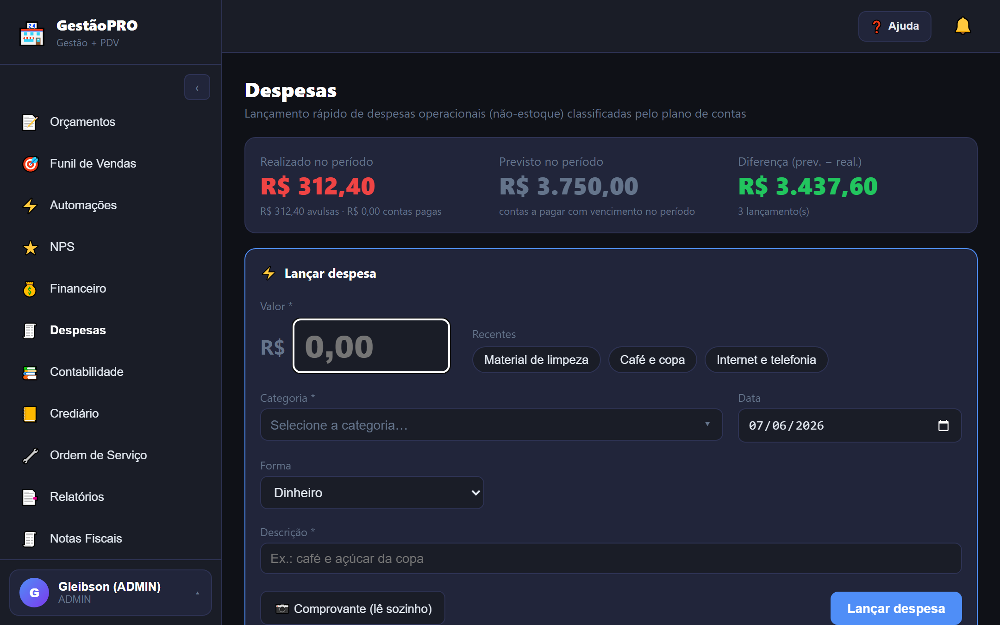

**Para que serve:** registrar gastos em segundos (pensado para ser tão rápido quanto mandar um WhatsApp) e deixar tudo organizado para o contador.

**Diferença para "Financeiro":** o Financeiro controla o que **vai vencer** (boletos, parcelas). Despesas é o que **você já gastou** agora. Quando você **dá baixa** numa conta a pagar no Financeiro, ela **já vira gasto realizado** — e aparece aqui na tela de Despesas, no ledger unificado, marcada com a etiqueta **conta a pagar** (em modo leitura; para editar/reabrir, use o Financeiro). **Não há registro duplicado:** a conta paga *é* o realizado, contando uma única vez no caixa e nos relatórios.

**Como usar:**

1. **Valor em destaque** — digite o valor (Enter já lança).
2. **Categoria** — use o **seletor pesquisável**: clique, digite parte do nome ou do código para filtrar e escolha. Se a categoria ainda **não existe**, digite o nome e toque em **➕ Criar categoria "…"** — ela é criada na hora (com código sugerido automaticamente) e já fica selecionada, sem sair do lançamento. Para o gasto do dia a dia, toque direto em um dos **chips de categorias recentes** (atalho de 1 toque). As categorias vêm do Plano de Contas.
3. **Data** (padrão hoje) e **Forma de pagamento** (Dinheiro, Pix, Débito, Crédito, Boleto).
4. **Descrição** e **📷 Comprovante** (foto ou PDF até 5 MB — no celular abre a câmera direto).
5. **Lançar despesa.**

**🏷️ Como criar uma categoria nova (sem sair do lançamento):** você não precisa cadastrar a categoria antes em outra tela — ela nasce no próprio campo **Categoria**:

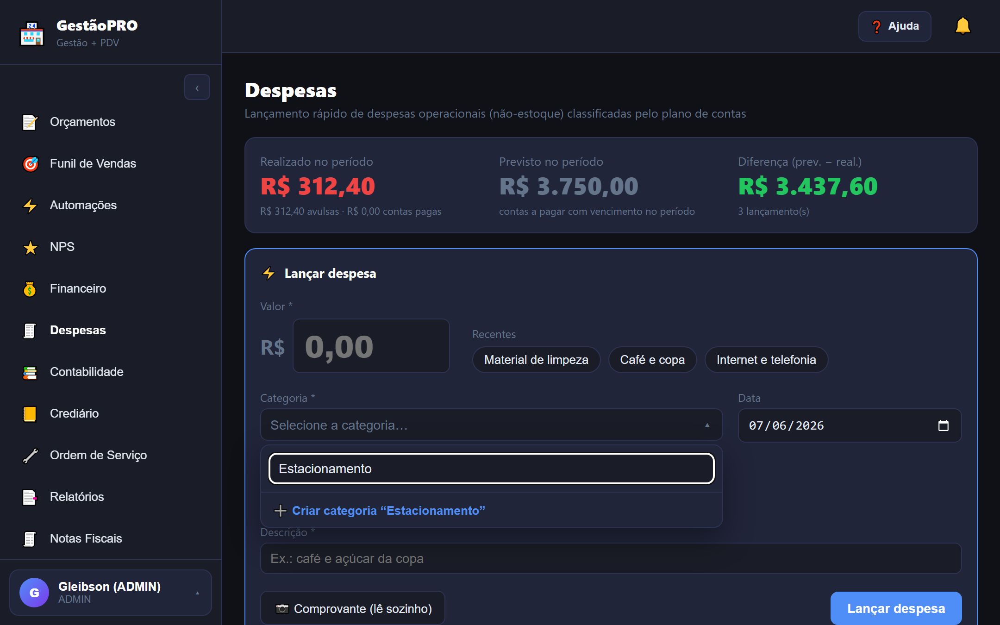

1. No card **⚡ Lançar despesa**, clique no campo **Categoria** para abrir o seletor.
2. No campo **"Buscar ou criar categoria…"**, **digite o nome** da nova categoria (ex.: `Estacionamento`).
3. Como ela ainda não existe, aparece a opção **➕ Criar categoria "…"**. Clique nela (ou apenas aperte **Enter**).
4. Pronto: a categoria é criada na hora — com o **código gerado automaticamente** seguindo o padrão do Plano de Contas (ex.: `3.1.05.002`) — e **já fica selecionada** na despesa. É só continuar e lançar.

> A opção **Criar** só aparece quando o texto digitado tem 2+ letras e **não corresponde** a nenhuma categoria existente (evita duplicar). Se já houver algo parecido, ele mostra na lista para você escolher.
>
> Esse é o **atalho rápido**. Para **editar nome/código, reorganizar, desativar** ou definir o **código contábil de-para** (usado na exportação do contador), use **Contabilidade → Plano de Contas**. Criar/editar categorias exige **Admin** ou **Gerente**.

**📷 Leitura automática do comprovante (OCR com IA):** ao escolher a foto/PDF do cupom, o sistema **lê o comprovante com inteligência artificial** e preenche sozinho o **valor, a data, a descrição e sugere a categoria**. Aparece a marca *"preenchido por IA — confira"*: revise e ajuste se precisar antes de lançar (a IA nunca grava sozinha). Despesas lançadas assim ficam marcadas com a etiqueta **OCR** na lista. Requer a chave da IA configurada no servidor (`ANTHROPIC_API_KEY`); se a leitura falhar, é só preencher na mão normalmente.

**Baixa no caixa:** se houver um caixa **aberto**, a despesa sai dele automaticamente (movimentação `DESPESA`). Excluir a despesa **estorna** o valor no caixa (se ainda estiver aberto).

**📊 Previsto × Realizado por categoria:** no topo da tela, o painel compara, no período filtrado, o que estava **previsto** (contas a pagar com vencimento no período) com o que foi **realizado** (contas a pagar pagas **+** despesas avulsas), categoria por categoria. As barras mostram a proporção e indicam **sobra** (gastou menos que o previsto) ou **estouro** (gastou mais, em vermelho). É o relatório de orçamento × execução do mês.

**📒 Realizado no período (ledger unificado):** a lista reúne, em um só lugar e ordenadas por data, as **despesas avulsas** lançadas aqui e as **contas a pagar pagas** no período. Cada gasto conta uma única vez. Filtre por **período** e **categoria**.

**Plano de Contas:** na primeira vez, o sistema cria um plano padrão para comércio/serviço (Ocupação, Pessoal, Administrativas, Comerciais, Financeiras, Impostos). Novas categorias podem ser criadas direto no seletor de categoria ao lançar a despesa (atalho rápido); a **gestão completa** do Plano de Contas (editar, reorganizar, desativar, código contábil de-para) fica em **Contabilidade**. Apenas Admin/Gerente criam/editam categorias.

**Comprovante:** clique no 📎 na lista para abrir/baixar o comprovante anexado.

> Acesso: módulo **Despesas** (incluído no plano PRO). **Quem tem a permissão Despesas pode lançar, editar e excluir** — inclusive um vendedor a quem você liberou o módulo (útil para a equipe registrar os próprios gastos: abastecimento, recarga, etc.). Quem **não** tem o módulo não vê a tela. *(A criação/edição do Plano de Contas continua restrita a Admin/Gerente.)*

#### 📚 Contabilidade

**O que faz:** tem **duas abas** — um **Painel** financeiro gerencial (para você decidir) e o **Fechamento** do período (para o contador). Um **filtro de período** no topo (Este mês · Últimos 3 meses · Este ano · Personalizado) atualiza as duas abas.

##### 📊 Aba Painel (visão gerencial)

Transforma vendas, despesas e contas a pagar/receber em gráficos de decisão rápida:

- **Faturamento líquido real** — (vendas do PDV + recebimentos avulsos) − (despesas + contas pagas) no período. As receitas de **crediário não são contadas em dobro**: recebimentos vinculados a uma venda já entraram pelo total da venda, então só os recebimentos **avulsos** somam aqui.
- **Distribuição de despesas (donut)** — para onde o dinheiro foi, por categoria do Plano de Contas. Mostra as **5 maiores categorias + "Outros"** (regra de Pareto) para o gráfico não virar um arco-íris ilegível.
- **Ponto de equilíbrio (breakeven)** — quanto você precisa faturar para cobrir os custos fixos do período. Calculado como *custos fixos ÷ margem de contribuição* (a margem vem do preço de venda menos o custo dos produtos vendidos). A barra mostra o quanto você já atingiu. Exige o **custo cadastrado nos produtos**; sem isso, aparece "sem dados de margem".
- **Entradas × saídas** — linha do período comparando o que entrou (vendas) com o que saiu (despesas + contas pagas).
- **Projeção de fluxo de caixa (30 dias)** — cruza **contas a receber** e **contas a pagar** pelos vencimentos dos próximos 30 dias, partindo do saldo dos caixas abertos. Se o saldo projetado **ficar negativo** em algum dia, aquele trecho é pintado de **vermelho** com um aviso — antecipe cobranças ou segure pagamentos. Contas **já vencidas** em aberto entram no 1º dia.

> O painel é só leitura e carrega rápido mesmo com muito histórico: tudo é somado direto no banco (índices por data/vencimento), sem baixar os lançamentos um a um.

##### 📚 Aba Fechamento (para o contador)

Consolida, num período, tudo que interessa à contabilidade e gera os arquivos para o contador.

**O que entra na consolidação:**
- **Despesas** do período (saídas);
- **Contas a pagar quitadas** no período (saídas);
- **Notas fiscais autorizadas** no período (receita/entradas).

**Como usar:**
1. Escolha o período (padrão: mês corrente).
2. Veja os **KPIs** (entradas, saídas, resultado, nº de lançamentos) e o gráfico de **despesas por categoria**.
3. Confira a lista de lançamentos (com link 📎 para o comprovante das despesas).
4. Exporte:
   - **⬇ Planilha (CSV)** — detalhe completo para conferência (abre no Excel).
   - **⬇ CSV Contábil (Domínio/Alterdata)** — lançamento enxuto (Data; Conta; Histórico; Valor; D/C). Usa o **código contábil externo** da categoria (campo de-para no Plano de Contas) quando preenchido — é o que deixa o arquivo pronto para importar no sistema do contador.

**Acesso do contador:** crie o contador em **Funcionários** como *Vendedor* e marque **apenas** a permissão **Contabilidade**. Ele entra e vê só esta tela — sem PDV, sem caixa, sem configurações e sem nenhum botão de edição. É um acesso de leitura/exportação.

**Fechamento mensal automático:** todo dia 1º o sistema apura o mês anterior e dispara uma **notificação** (sino no topo) avisando que o mês fechou, com os totais de receitas e despesas — um lembrete para exportar o pacote do contador. Só chega para empresas que tiveram movimento no mês.

> Os dois CSV são gerados no próprio navegador (como os relatórios em PDF), com acento correto no Excel. Acesso: módulo **Contabilidade** (plano PRO).

#### 📒 Crediário (Fiado)

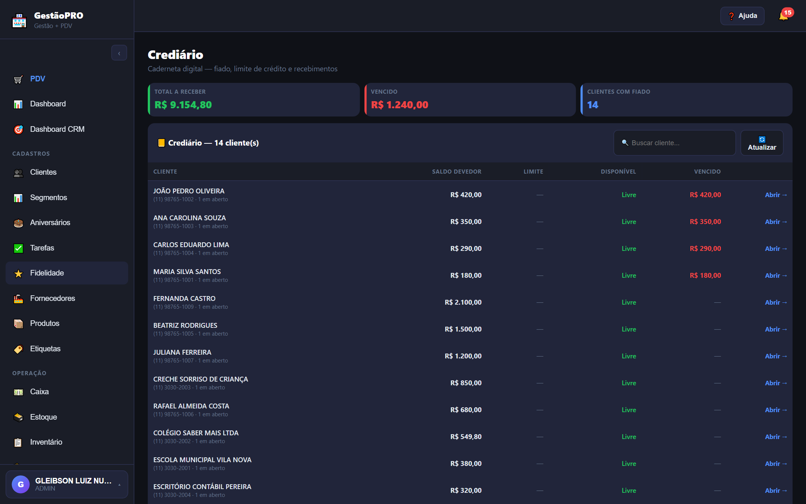

Caderneta digital de venda a prazo. Acompanha o saldo devedor de cada cliente sobre as contas a receber em aberto.

- **Lista de clientes** com saldo devedor, limite de crédito, crédito disponível e total vencido (em vermelho).
- **Caderneta do cliente** (clique no nome): resumo + todos os lançamentos (em aberto, pagos, vencidos).
- **Lançar compra no fiado:** informe valor, descrição e vencimento (em branco = 30 dias). Gera uma conta a receber. Se o cliente tiver **limite de crédito** definido, o sistema bloqueia lançamentos que ultrapassem o limite.
- **Receber:** dá baixa em uma compra (quita a conta a receber).
- **Limite de crédito:** definido por ADMIN/GERENTE na caderneta. Vazio = sem limite (fiado livre, só acompanha o saldo).

> O crediário usa as Contas a Receber por baixo — uma venda a prazo e o fiado aparecem no mesmo lugar do Financeiro.

#### 🍔 Cardápio digital (pedido online)

Página pública onde o cliente final monta o próprio pedido, sem login. Os pedidos caem direto na **Central de Comandas** como DELIVERY ou Retirada (status NOVO).

- **Ativar:** Empresa → bloco "Cardápio digital" → **Ativar cardápio** (gera um link público + QR Code).
- **Divulgar:** imprima o **QR Code** nas mesas/balcão ou compartilhe o **link** no WhatsApp e redes.
- **Cliente:** abre o link, escolhe os itens, informa nome/telefone e endereço (se entrega) e envia. Recebe o número do pedido.
- **Loja:** o pedido aparece na Central de Comandas para preparo e entrega, com telefone e endereço do cliente.
- Os preços são sempre os do cadastro de Produtos (o cliente não consegue alterar).

> Disponível a partir do plano **Pro**. Só ADMIN/GERENTE ativa/desativa.

#### 🔧 Ordem de Serviço

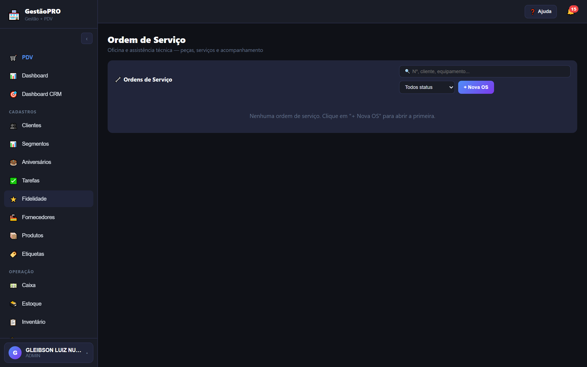

Para oficinas e assistências técnicas (encaixa no segmento **Auto-Peças**, mas serve qualquer reparo). Controla o ciclo do serviço da abertura à entrega.

- **Abrir OS:** cliente/telefone, equipamento (veículo, aparelho…), defeito relatado.
- **Itens:** adicione **peças** (🔩) e **serviços/mão de obra** (🛠️) com quantidade e valor — o total (peças + serviços − desconto) é calculado automaticamente.
- **Diagnóstico:** registre o que o técnico encontrou.
- **Status:** Aberta → Em andamento → Aguardando peça → Pronta → Entregue (ou Cancelada). Cada mudança fica registrada com data.
- **Lista** com filtro por status e busca por nº, cliente ou equipamento.

> Disponível a partir do plano **Pro**. OS entregue ou cancelada não pode ser editada (só ADMIN/GERENTE exclui).

#### 📄 NF-e 55 / NFS-e (fiscal avançado)

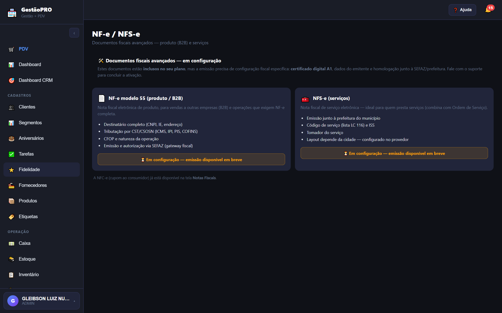

Documentos fiscais além da NFC-e, na tela **NF-e / NFS-e**:

- **NF-e modelo 55** — nota de produto para vendas a outras empresas (B2B).
- **NFS-e** — nota de serviço (combina com Ordem de Serviço), emitida junto à prefeitura.

> Inclusos no plano **Enterprise**. A emissão exige **certificado digital A1**, dados do emitente e homologação junto à SEFAZ/prefeitura — por isso aparecem como **"em configuração"** até a ativação fiscal ser concluída com o suporte. A NFC-e (cupom) continua na tela Notas Fiscais.

---

### 5.6 Atendimento

#### 💬 WhatsApp

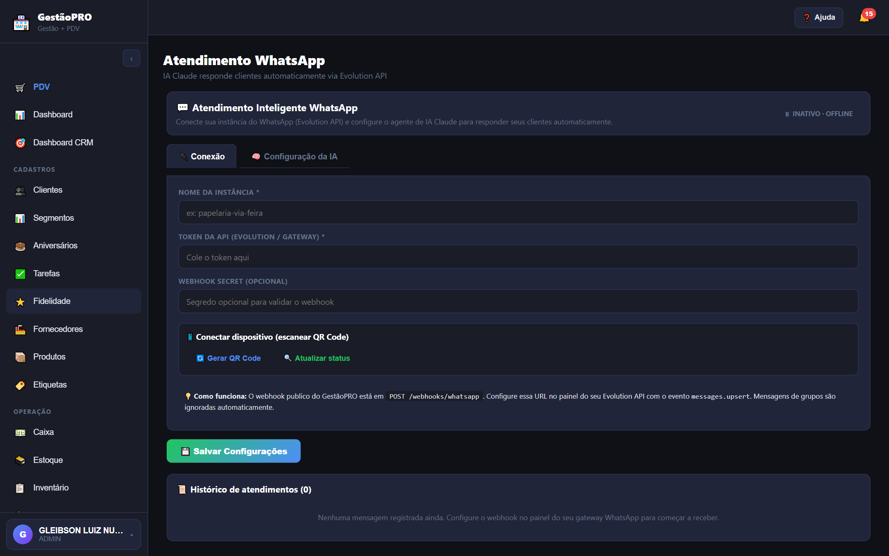

**O que faz:** atendimento integrado com mensagens diretas, templates e histórico de conversas.

**Para que serve:** centralizar o atendimento via WhatsApp Business sem precisar abrir o aplicativo separadamente.

**Como usar:** depende da integração configurada (varia por instalação).

---

### 5.7 Sistema

#### 📊 Dashboard

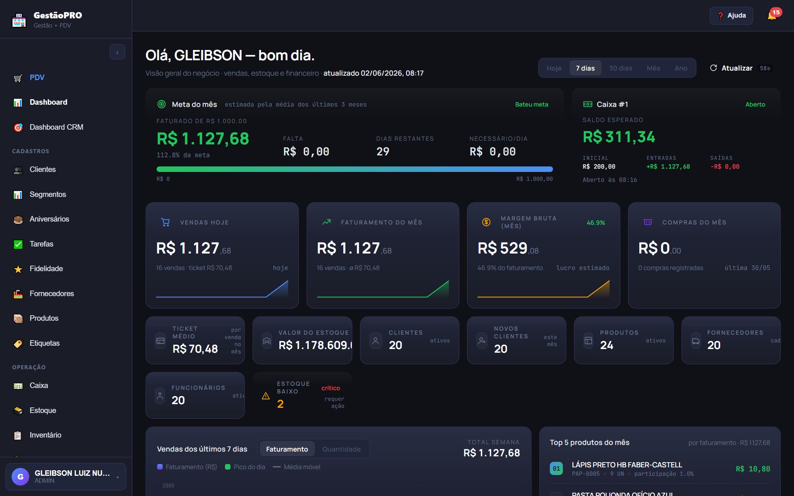

**O que faz:** painel principal com KPIs do dia/semana/mês.

**Mostra:**
- Vendas do dia (valor + qtd)
- Gráfico de vendas semanal (barra por dia)
- Top 5 produtos mais vendidos
- Top 5 vendedores
- Últimas vendas e últimas compras (lado a lado)
- Resumo financeiro (a pagar / a receber / vencendo / atrasadas)

> O **mini-card "Estoque baixo"** (só a contagem) continua no dashboard, mas a **lista detalhada** de produtos abaixo do mínimo foi movida para a tela **🗃️ Estoque** — assim itens descontinuados não poluem a visão geral.

---

#### 📑 Relatórios

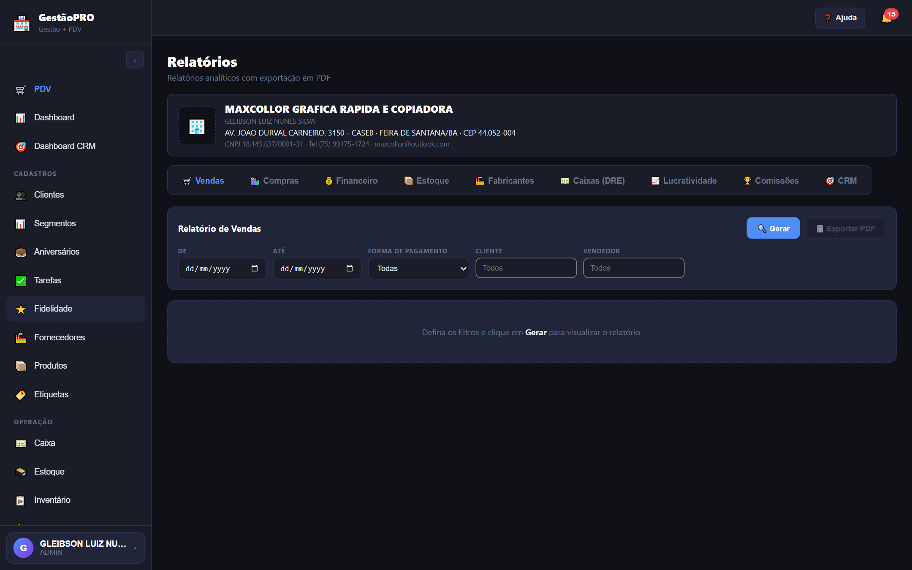

**O que faz:** 13 abas de relatórios com filtros e **export PDF** com cabeçalho da empresa.

**Abas:**

1. **📦 Vendas** — período, vendedor, forma, cliente. Tabela + totais.
2. **🛍 Compras** — período, fornecedor. Tabela + totais.
3. **💰 Financeiro** — filtros de período (vencimento), **Tipo** (Ambos / Apenas a pagar / Apenas a receber), **Situação** (Todas / Pendentes / Pagas-Recebidas / Atrasadas / Canceladas) e **Cliente** ou **Fornecedor** (campo de busca largo, conforme o Tipo escolhido). Mostra cards de saldo previsto / fluxo realizado / pendentes, o "Resumo por status" (visão geral sempre completa) e o detalhamento de contas — este último respeita o filtro de Situação.
4. **🗃 Estoque** — situação atual por produto/categoria.
5. **🏭 Fabricantes** — produtos filtrados por fabricante/marca (e categoria), agrupados por fabricante com subtotais (nº de produtos, unidades e valor de estoque a custo/venda). Filtro "(Sem fabricante)" lista os produtos sem marca cadastrada; opção de incluir inativos.
6. **💵 Caixas (DRE)** — DRE diário com entradas/saídas/quebras/sobras + detalhe por caixa.
7. **📈 Lucratividade / Margem** — receita, custo (CMV), lucro e margem por categoria e por produto; filtro por categoria e vendedor.
8. **🔤 Curva ABC** — classificação de Pareto (80/15/5) dos produtos por **Receita**, **Lucro** ou **Quantidade**. Mostra a faixa de distribuição A/B/C (quantos produtos concentram a maior parte do resultado), o % individual e acumulado de cada item e a classe (A/B/C). Filtros: período, categoria e critério. Útil para priorizar reposição, negociação com fornecedor e foco comercial nos itens vitais (classe A).
9. **🔄 Giro & Capital Parado** — cruza o estoque atual com o que vendeu no período. Mostra **capital parado** (dinheiro empatado na prateleira), **giro** (quantas vezes o estoque girou) e **cobertura** (dias que o estoque atual dura). Classifica cada item em **Parado** (não vendeu), **Baixo giro**, **Saudável** ou **Alto giro**. Sem período informado usa os últimos 90 dias. Filtros: período, categoria e fornecedor. Útil para liquidar encalhados e evitar ruptura nos itens de alto giro.
10. **🗓️ Sazonalidade** — mapa de calor **dia da semana × hora** com volume de vendas ou faturamento (alterna na **Métrica**). Identifica picos e vales para dimensionar escala de funcionários e programar promoções. Mostra melhor dia e horário de pico. Horários no fuso de Brasília. Sem período informado usa os últimos 90 dias.
11. **⏳ Aging de Recebíveis** — idade da dívida das contas a receber em aberto, distribuída em faixas (**A vencer**, **1–30**, **31–60**, **61–90**, **90+ dias** de atraso). Mostra total em aberto, total vencido (inadimplência) com %, ranking de **clientes devedores** (com maior atraso) e o detalhe de cada conta. Filtro por cliente. Útil para priorizar cobrança e medir risco de calote do crediário.
12. **🏆 Comissões** — ranking por vendedor.
13. **🎯 CRM** — 7 sub-relatórios:
   - Funil de Vendas (conversão etapa-a-etapa)
   - Performance Comercial
   - Carteira (RFM detalhado)
   - NPS
   - Atividades & Cadência
   - Forecast
   - Perdas (motivos)

**PDF:** cabeçalho com logo + razão social + CNPJ + endereço, depois título, período e tabelas.

---

#### 🔔 Alertas

**Acessado pelo sino 🔔 no header.**

**O que faz:** painel lateral com alertas operacionais.

**Tipos de alerta:**
- 📦 Produto X abaixo do estoque mínimo (clique → vai pro Estoque)
- 💸 Conta a pagar vencendo / atrasada
- 💰 Conta a receber vencendo / atrasada

**Polling:** atualiza a cada 60s automaticamente.

---

#### 🏢 Empresa

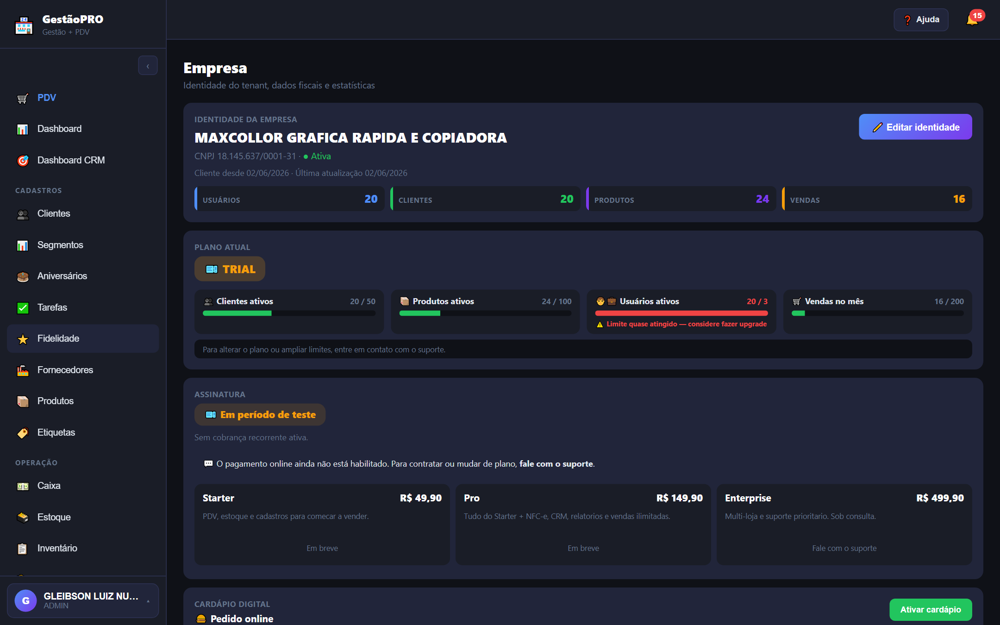

**O que faz:** cadastro singleton de **Dados do Emitente** (razão social, CNPJ, endereço, contato, logotipo) + **Plano + Limites de uso**.

**Para que serve:** aparece no cupom do PDV, no extrato do Caixa e no cabeçalho dos PDFs de Relatórios. Tela única.

**Como usar:**

1. Aba **Identidade** — razão social, nome fantasia, CNPJ, inscrição estadual, telefone, e-mail.
2. Aba **Endereço** — com ViaCEP.
3. Aba **Logotipo** — dropzone (JPG/PNG/WebP, até 2 MB).
4. Aba **Observações** — texto livre que aparece em todos os relatórios.

**Bloco "Plano":**

- Badge do plano (TRIAL / FREE / STARTER / PRO / ENTERPRISE)
- Aviso de expiração (vermelho se expirou, amarelo se ≤7 dias)
- 4 barras de progresso uso/limite:
  - **Clientes** (X / Y)
  - **Produtos** (X / Y)
  - **Usuários** (X / Y)
  - **Vendas no mês** (X / Y)
- Cores: 🟢 <70%, 🟡 70-90%, 🔴 ≥90%
- `∞` = ilimitado

**Bloco "Preferências deste dispositivo":**

- 📡 **Avisos de conexão com o servidor** — interruptor liga/desliga a tarja vermelha/amarela do topo e os toasts automáticos de "sem conexão" / "servidor instável". Erros específicos das telas (validação, 4xx) continuam aparecendo normalmente. Vale só neste navegador (localStorage).

---

#### 🖨️ Configurações de Impressora

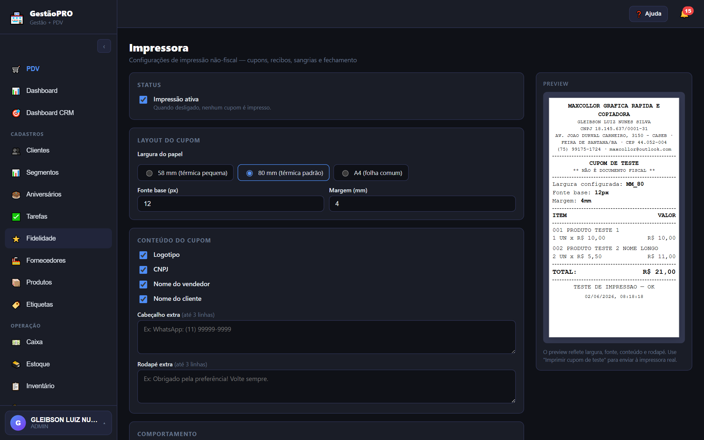

**O que faz:** define como os cupons (venda, orçamento, sangria, suprimento, fechamento e recibos) são impressos. Tela em duas colunas: **formulário** à esquerda e **preview do cupom em tempo real** à direita (botão **🖨️ Imprimir cupom de teste**).

**Principais ajustes:**

- **Largura do papel:** 58 mm, **80 mm** (térmica padrão) ou A4.
- **Fonte base** e **margem** — dica: aumente a fonte (ex.: 14) se a térmica imprimir fraco.
- **Conteúdo:** ligar/desligar logo, CNPJ, vendedor e cliente; **cabeçalho** e **rodapé** extras (até 3 linhas).
- **Comportamento:** vias por venda, linhas em branco no fim, **imprimir automaticamente ao concluir a venda** e **abrir gaveta** em vendas no dinheiro (requer agente ESC/POS).
- **Quais documentos imprimem:** marque venda, orçamento, sangria, suprimento, fechamento e recibo financeiro.

**Como o cupom é impresso — dois caminhos:**

1. **Pelo navegador (padrão, sem instalar nada):** usa a janela de impressão do navegador. Imprime na **impressora padrão do Windows**. Para sair sem caixa de diálogo, use o atalho do Chrome em modo `--kiosk-printing`.
2. **Pelo agente (QZ Tray) — impressão direta e silenciosa:** imprime o cupom **direto numa impressora escolhida pelo nome**, sem caixa de diálogo e **sem mexer na impressora padrão do Windows** (ideal quando o mesmo PC também imprime em outras impressoras).

##### Impressão direta via agente (QZ Tray)

> Card **"Impressão direta via agente (QZ Tray)"** na tela de Impressora. Configuração **por computador** (vale só naquele PC).

1. Baixe e instale o app gratuito **QZ Tray** em [qz.io/download](https://qz.io/download) — deixe-o aberto (fica na bandeja, perto do relógio; marque **Start automatically** para subir com o Windows).
2. No card, clique **Detectar agente / listar impressoras**.
3. Escolha a sua impressora térmica na lista **Impressora deste PC**.
4. Ligue o switch **Usar o agente para imprimir o cupom da venda**.
5. Na **primeira** impressão, o QZ pede confirmação → marque **Remember this decision** + **Allow**. A partir daí, **silêncio total** naquele PC.

**Boa notícia:** o sistema já vem com o **certificado de assinatura embutido**, então o QZ reconhece o GestãoProMax como confiável (não fica pedindo permissão a cada impressão). Se o agente estiver fechado ou falhar, o sistema **cai automaticamente na impressão pelo navegador** — nunca trava a venda.

> 💡 Papel saiu fraco/falhado? É **densidade** da impressora (ajuste no utilitário ou no autoteste dela, não no sistema). Acentos errados ou corte no rodapé já são tratados automaticamente pelo sistema.

---

#### 🧑‍💼 Funcionários (ADMIN only)

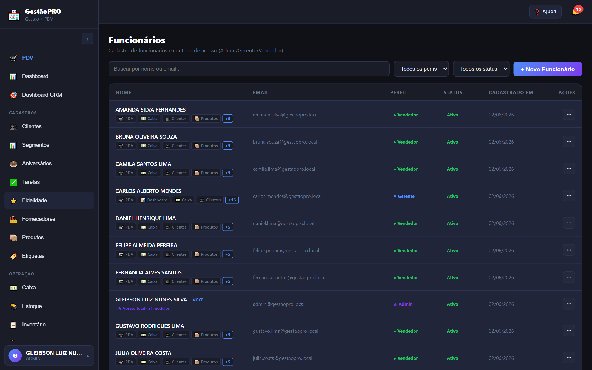

**O que faz:** CRUD de usuários do sistema.

**Como usar:**

1. **+ Novo funcionário** → nome, e-mail, telefone, senha temporária, papel (ADMIN/GERENTE/VENDEDOR), módulos liberados (checkboxes).
2. Tabela lista todos com chips de módulos coloridos (até 4 + `+N`).
3. Ações: editar, **trocar senha**, inativar/reativar, excluir (só se não tiver vendas vinculadas).

---

#### 📲 Maquininha MP / Mercado Pago

**Em Configurações:** bloco dedicado.

**Para configurar (1ª vez):**

1. Pegue o **Access Token** no painel do Mercado Pago Developers.
2. Pegue o **Device ID** do parelhamento da maquininha (Modo PDV).
3. Cole nos campos correspondentes na tela Configurações.
4. Marque "Ativa".
5. Salve.

A partir daí, o PDV mostra o botão **📲 Maquininha MP** no modal de finalizar. O cliente passa o cartão na maquininha física; o sistema aguarda aprovação via polling + webhook.

**Token cifrado** (AES-256-GCM) no banco — não é exibido após salvar (mascarado).

---

#### 🧾 Boleto + PIX (Asaas)

**Em Configurações:** bloco dedicado (**🧾 Boleto + PIX (Asaas)**). Permite emitir **boletos híbridos** (boleto com PIX embutido) para cobrar seus clientes pelas contas a receber. O dinheiro cai na **sua conta Asaas**.

**Para configurar (1ª vez):**

1. Crie uma conta no **Asaas** — para testar sem risco, use o ambiente de **sandbox** (`sandbox.asaas.com`).
2. No painel Asaas: **Integrações → Chave de API** → gere e copie a chave (começa com `$aact_...`).
3. Na tela Configurações, cole no campo **API Key**, escolha o **Ambiente** (Sandbox para teste / Produção para valer).
4. Marque **"Emissão de boleto ativa"** e salve.
5. Copie a **URL do webhook** que aparece e cole em **Asaas → Configurações → Webhooks** (eventos de cobrança/pagamento). É isso que dá a **baixa automática** da conta quando o cliente paga.

A partir daí, o **Financeiro → Contas a Receber** mostra a ação **"Gerar boleto (Asaas)"** nas contas em aberto (ver seção Financeiro).

**Repassar a taxa do boleto ao cliente:** opção que soma uma taxa fixa ao valor cobrado — **desligada por padrão** (é decisão sua; verifique as regras do seu contrato).

**Chave cifrada** (AES-256-GCM) no banco — não é exibida após salvar (mascarada). A cobrança é feita pela **sua** conta Asaas (por empresa), separada da cobrança da assinatura do sistema.

---

#### 📋 Projeto

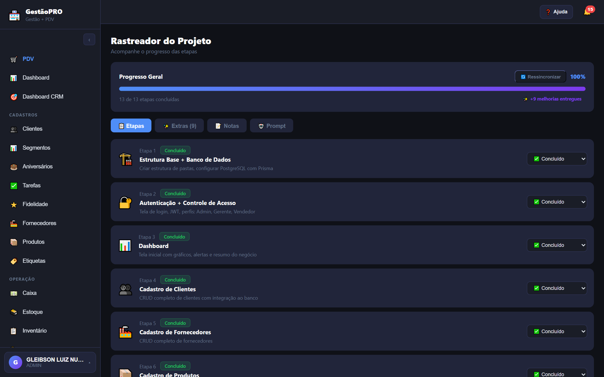

**O que faz:** acompanha as 14 etapas planejadas do sistema com status (✅ concluído / ⏳ em andamento / 🔜 planejado).

**Para que serve:** transparência sobre o que está pronto e o que vem a seguir.

---

#### 📜 Logs de Auditoria (ADMIN only)

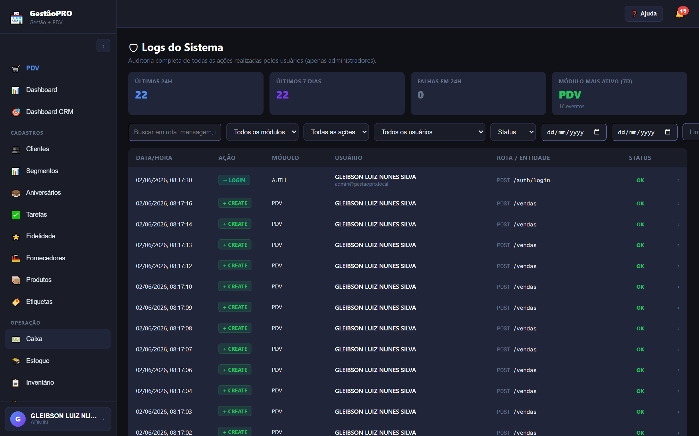

**O que faz:** trilha completa de tudo que acontece no sistema.

**Para que serve:** auditoria, segurança, investigação de problema.

**Registra:**
- Login / Login Falho (com motivo) / Logout / Troca de senha
- Toda operação CREATE / UPDATE / DELETE
- IP, user-agent, rota, payload sanitizado (sem senhas/tokens)
- **Diff campo a campo** em updates (antes/depois lado a lado)
- Reset Total (com breakdown completo)

**Tabela densa** com filtros: usuário, módulo, ação, sucesso/falha, período, busca em rota/mensagem. Clique numa linha expande mostrando diff visual em vermelho/verde.

**KPIs:** 24h, 7d, falhas, módulo mais ativo.

---

#### 💾 Backup (ADMIN only)

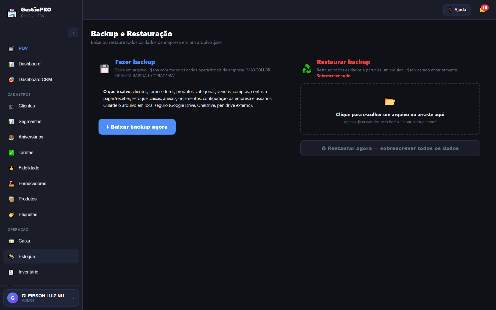

**O que faz:** baixa um JSON com todos os dados do tenant ou restaura a partir de um JSON.

**Para que serve:** segurança contra perda de dados, migração entre ambientes.

**Como usar:**

1. **Download** — botão "Baixar backup" → gera JSON com timestamp no nome → salva no computador.
2. **Restaurar** — botão "Restaurar de arquivo" → escolhe JSON → confirmação dupla (digita "RESTAURAR") → substitui dados atuais.

> Ferramenta mais robusta para devs: `npm run db-manager backup` / `restore` no backend, via pg_dump/psql.

---

#### 🛡 Sistema (ADMIN only)

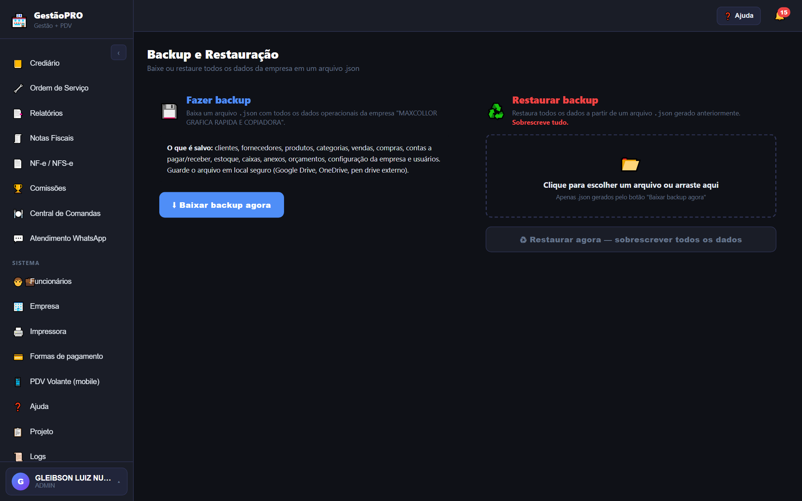

**O que faz:** ações administrativas críticas.

**Inclui:**

- **Reset Total** — apaga **tudo** (vendas, caixas, compras, estoque, financeiro, cadastros, produtos, fotos, anexos) mas preserva funcionários, dados da empresa e logotipo. Confirmação dupla com texto "CONFIRMAR_RESET". Auditado no Logs com breakdown.
- **Gerenciar formas de pagamento custom** — criar formas além das 6 padrão (Dinheiro/PIX/Débito/Crédito/Boleto/Crediário).
- **Configurações gerais** (cor de tema padrão, comportamento de pré-impressão, etc.).

---

#### 🎨 Aparência

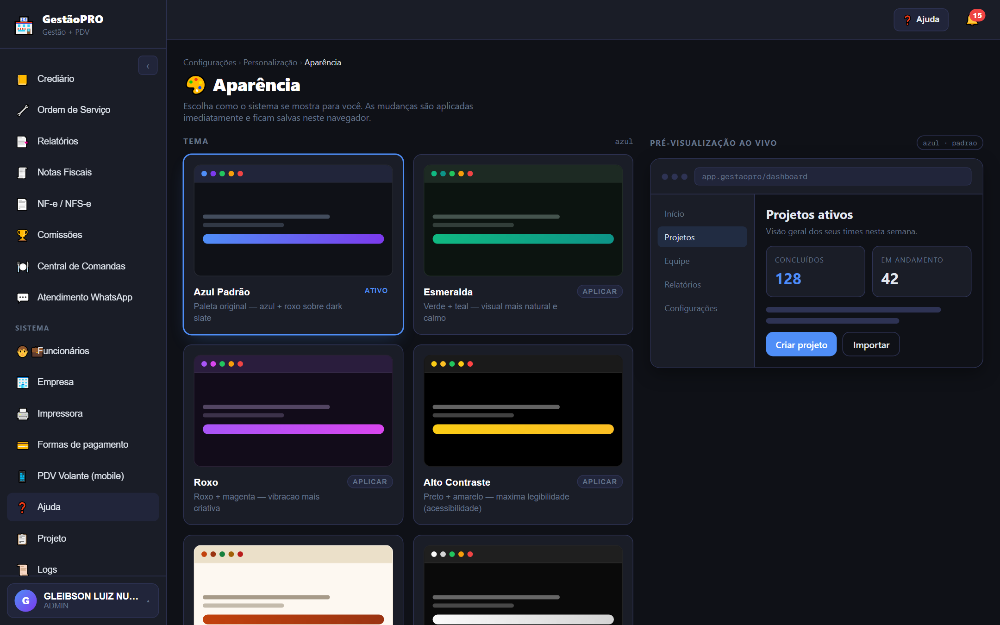

**Acessado pelo avatar no header.**

**O que faz:** escolha entre **6 temas** (3 claros, 3 escuros).

**Persistência:** preferência sincronizada entre dispositivos (salva no servidor).

---

## 6. Resiliência a falhas de rede

O sistema é projetado para **degradar com graça** quando a internet falha.

**Indicadores visuais:**

- **Tarja vermelha** no topo: você está **offline** (sem internet).
- **Tarja amarela** no topo: internet OK mas o **servidor está instável** (timeout/5xx).
- **Toasts inferior direito**: erros classificados em NETWORK / TIMEOUT / SERVER_5XX / CLIENT_4XX / AUTH / ABORT — dedup de 1.5s pra não floodar.

**Comportamentos:**

- **PDV** — o **carrinho é salvo a cada 600ms** no navegador (localStorage). Se a aba fecha ou o navegador trava, ao reabrir aparece banner "Você tinha N itens — Recuperar / Descartar".
- **PDV Volante (mobile)** — comandas novas podem ser criadas **offline** (sincronizam depois). Adicionar item a comanda existente exige rede.
- **Finalizar venda** — bloqueado offline (precisa do servidor).
- **Botões críticos** ficam meio-opacos / sem clique quando degradado (classe `gp-bloqueio-offline`).
- Timeout padrão: 15s nas APIs, 60s em upload.
- **Desligar avisos:** se preferir uma tela mais limpa, vá em **Empresa → Preferências deste dispositivo** e desligue *Avisos de conexão com o servidor*. A tarja e os toasts automáticos somem; o bloqueio do "Finalizar venda" continua valendo.

---

## 7. Atalhos de teclado

### PDV

| Tecla | Ação |
|-------|------|
| **Enter** | Bipa o produto ou adiciona o primeiro da sugestão |
| **Setas ↑↓** | Navega nas sugestões |
| **Esc** | Limpa o campo de busca / fecha modal |
| **F1** | Pagamento em Dinheiro |
| **F2** | Pagamento em PIX |
| **F3** | Cartão Débito |
| **F4** | Cartão Crédito |
| **F5** | Boleto |
| **F6** | Crediário |
| **F7** | Alterna modo focado (Clean) ↔ layout completo |
| **F8** | Modal "Cancelar item" |
| **F9** | Salvar atendimento em espera |
| **F10** | Abre modal de pagamento |

### Modais (geral)

| Tecla | Ação |
|-------|------|
| **Esc** | Fecha o modal |
| **Enter** | Confirma o formulário |

### Sidebar

| Tecla | Ação |
|-------|------|
| Logo (clique) | Recolhe/expande |
| **Esc** (mobile) | Fecha a sidebar off-canvas |

---

## 8. Termos do sistema (glossário)

| Termo | Significado |
|-------|-------------|
| **PDV** | Ponto de Venda. Tela onde se registra a venda no balcão. |
| **Caixa** | Controle do dinheiro físico do PDV. Abrir/Fechar/Sangria/Suprimento. |
| **Sangria** | Retirar dinheiro do caixa (ex: levar ao cofre, depositar). |
| **Suprimento** | Colocar dinheiro no caixa (ex: troco extra). |
| **Quebra** | Faltou dinheiro no fechamento (contado < esperado). |
| **Sobra** | Sobrou dinheiro no fechamento (contado > esperado). |
| **Conta a Pagar** | Compromisso financeiro com fornecedor. |
| **Conta a Receber** | Compromisso financeiro do cliente com a loja. |
| **Crediário** | Venda fiada com pagamento parcelado. |
| **LTV** | Lifetime Value — total que um cliente já gastou. |
| **RFM** | Recência / Frequência / Monetário — modelo de segmentação. |
| **NPS** | Net Promoter Score — % Promotores − % Detratores. |
| **CRM** | Customer Relationship Management — gestão do relacionamento. |
| **Funil** | Etapas do processo comercial (Lead → Ganho/Perdido). |
| **Oportunidade** | Negócio em andamento, ainda não fechou. |
| **Lead** | Contato que ainda não comprou. |
| **Comanda** | Pedido aberto de mesa/viagem/delivery, antes de virar venda. |
| **Adendo** | Itens novos adicionados a uma comanda já aberta. |
| **Recorrência** | Conta repetida mês a mês (mensal/parcelada). |
| **Soft-delete** | "Excluir" mantendo no banco (ativo=false). Reativável. |
| **Hard-delete** | Excluir permanentemente. Só se não houver vínculos. |
| **Multi-tenant** | Cada empresa opera em espaço isolado. |
| **Tenant** | A empresa em si (sua conta no sistema). |

---

## 9. Operações no celular

O sistema é **PWA** — pode ser instalado como app no celular pelo banner do navegador ou pelo menu "Adicionar à tela inicial".

**Telas otimizadas para celular:**

- **PDV Volante** — versão de PDV para garçom/atendente.
- **Inventário Mobile** — contagem cíclica no chão da loja.
- **Central de Comandas** — Kanban responsivo.
- **Demais telas** — usam sidebar off-canvas com botão `☰`.

**Dicas:**

- Use Chrome ou Edge no Android, Safari no iOS.
- Adicione à tela inicial para ter ícone próprio e tela cheia.
- Verifique permissão de **Bluetooth** se for usar impressora térmica.

**Atualizações de versão:** quando uma versão nova é publicada, aparece um banner verde **"Nova versão disponível — Toque em Atualizar"** no rodapé. A atualização **não é automática** (pra não recarregar no meio de uma venda): toque em **Atualizar** quando estiver num momento seguro. O app também checa por versão nova sozinho a cada 30 min. Se o banner não aparecer e você suspeitar que está numa versão antiga, recarregue a página (no celular, feche e reabra o app).
- Carrinho do PDV não roda offline — depende do servidor.

---

## 10. Planos e limites

| Plano | Clientes | Produtos | Usuários | Vendas/mês |
|-------|----------|----------|----------|------------|
| **FREE** | 30 | 50 | 1 | 50 |
| **TRIAL** | 50 | 100 | 3 | 200 |
| **STARTER** | 500 | 1.000 | 5 | 2.000 |
| **PRO** | 5.000 | 10.000 | 20 | ∞ |
| **ENTERPRISE** | ∞ | ∞ | ∞ | ∞ |

**O que acontece ao estourar:** o sistema retorna **402 Pagamento Necessário** ao tentar criar acima do limite e mostra mensagem amigável com o plano atual + uso atual. Demais operações (editar, ver, excluir) seguem funcionando.

**Como ver o uso atual:** Empresa → Bloco "Plano" → barras de progresso.

### Limite de máquinas (licença por dispositivo)

Cada empresa tem um **número máximo de máquinas conectadas simultaneamente** (computadores/navegadores). Serve para que um cliente que contratou, por exemplo, 1 máquina não use o sistema em vários computadores ao mesmo tempo.

**Limite por plano (padrão):** quando nada é definido manualmente, o limite vem do plano:

| Plano | Máquinas |
|-------|----------|
| **FREE** | 1 |
| **TRIAL** | 2 |
| **STARTER** | 2 |
| **PRO** | 5 |
| **Enterprise** | ilimitado |

- **Override por empresa:** Admin Master → empresa → 🎫 **Alterar plano** → **Limite de máquinas**. Deixe **vazio** para *herdar o limite do plano*, **0** para *ilimitado*, ou um número fixo (ex.: 3).
- **Como funciona:** a cada login o sistema identifica o navegador. Se for uma máquina já conhecida, libera; se for nova e o limite já estiver cheio, o login é **recusado (403)** e o cliente vê a tela de bloqueio com as máquinas ativas.
- **Cliente se vira sozinho (autogestão):** na tela de bloqueio o cliente pode **desconectar** uma máquina antiga (reconfirmando e-mail/senha) e entrar na nova. Além disso, em **Empresa → 🖥️ Dispositivos**, o ADMIN/GERENTE do cliente vê todas as máquinas conectadas, **renomeia** (apelido: "PC do balcão") e **desconecta** as que quiser — sem precisar do suporte. O aparelho em uso aparece marcado como **ESTE**.
- **Alerta de novo acesso:** quando uma **máquina nova** entra na conta, é criada uma notificação no sino (🔔) avisando o aparelho, data/hora e IP — para o cliente perceber acesso indevido.
- **Suporte libera vagas:** em Admin Master → empresa → seção **🖥️ Dispositivos**, o super-admin vê todas as máquinas (ativas e revogadas) e pode **Desconectar** qualquer uma.
- **A desconexão é imediata:** uma máquina desconectada cai para o login assim que faz qualquer ação; e mesmo parada, é deslogada sozinha em até **30 segundos**. Não é preciso esperar a pessoa fechar o navegador.
- **Limpeza automática:** máquinas sem acesso há mais de **60 dias** são desconectadas automaticamente (liberam a vaga sozinhas) — útil quando o cliente trocou de computador e nunca derrubou o antigo.
- **Robustez:** o identificador é guardado de forma redundante (localStorage + cookie de longa duração), então limpar o histórico normalmente não consome uma vaga nova.

### Módulos liberados por plano

Além dos limites de quantidade, **cada plano libera um conjunto de módulos** (telas/funcionalidades). Módulos fora do plano ficam ocultos na barra lateral e bloqueados no acesso.

| Pacote | Módulos inclusos |
|--------|------------------|
| **Núcleo** (todos os planos) | PDV, Caixa, Dashboard, Produtos, Funcionários |
| **Starter** | Núcleo + Clientes, Estoque, Fornecedores, Orçamentos, Crediário (Fiado) |
| **Pro** | Starter + Compras, Inventário, Financeiro, Relatórios, Comissões, Central de Comandas, **Ordem de Serviço**, **NFC-e (emissão fiscal)**, **Cardápio digital** |
| **Enterprise** | Pro + Funil de Vendas, Automações, NPS, Atendimento WhatsApp, **NF-e 55 / NFS-e** (todos) |

> **NFC-e por plano:** a emissão de Nota Fiscal de Consumidor (modelo 65) é liberada a partir do plano **Pro**. Empresas em planos sem fiscal não veem a tela "Notas Fiscais" nem conseguem emitir/configurar — o sistema responde que o módulo não está incluído. Pode ser liberado avulso a uma empresa específica pelo Admin Master.

> **Módulos avulsos:** o administrador da plataforma pode liberar ou remover módulos individuais de uma empresa específica (ex.: vender só o WhatsApp a um cliente do plano Pro), independentemente do pacote padrão do plano. Feito no Admin Master → 🎫 Alterar plano → "Módulos liberados".

Se um usuário tentar acessar um módulo fora do plano, o sistema responde que **o módulo não está incluído no plano atual** e sugere upgrade.

### Assinatura e cobrança mensal

Os planos pagos são cobrados por **assinatura mensal recorrente**. O bloco **"Assinatura"** na tela **Empresa** mostra o estado da cobrança e permite contratar.

| Status | O que significa |
|--------|-----------------|
| 🎫 **Em período de teste** | Trial gratuito; ainda não há cobrança recorrente |
| ✅ **Assinatura ativa** | Pagamento em dia; o acesso é renovado automaticamente a cada pagamento |
| ⚠️ **Pagamento em atraso** | A cobrança venceu; há um período de carência antes da suspensão |
| 🚫 **Cancelada** | A assinatura foi encerrada |

**Como contratar (apenas o administrador):** Empresa → bloco "Assinatura" → escolha o plano → **Assinar**. O sistema gera uma cobrança (PIX, boleto ou cartão) e abre o link de pagamento. **Assim que o pagamento é confirmado, o acesso é liberado/renovado automaticamente** — não é preciso avisar o suporte.

- **Preços de referência:** Starter R$ 49,90/mês · Pro R$ 149,90/mês · Enterprise sob consulta.
- **Cobrança em aberto:** se houver uma fatura pendente, aparece um aviso com o botão **"Pagar agora"**.
- **Histórico:** o bloco lista as últimas cobranças (data, método, valor e situação).
- **Atraso:** se uma cobrança vencer e não for paga, a assinatura fica *em atraso* e, após a carência, o acesso é suspenso até a regularização. Pague a fatura em aberto para reativar.

> O **certificado digital A1** necessário para emitir NFC-e é contratado e pago separadamente pela própria empresa (não está incluso na mensalidade do sistema).

---

## 11. Perguntas frequentes

### Esqueci a senha. Como recupero?

Não há recuperação por e-mail. Peça a um **ADMIN** ir em **Funcionários** → seu usuário → **Trocar senha**. Você troca de novo no próximo login.

### Posso usar sem internet?

Apenas parcialmente:
- ✅ Carrinho do PDV em andamento (auto-salvo no navegador).
- ✅ Criar nova comanda no PDV Volante (sincroniza depois).
- ❌ Finalizar venda no PDV.
- ❌ Adicionar item em comanda existente.
- ❌ Consultar clientes/produtos novos.

### Como faço backup dos meus dados?

ADMIN → **Backup** → "Baixar backup" → salva JSON. Faça isso semanalmente.

### O sistema imprime nota fiscal?

Não diretamente. Os produtos têm campos fiscais (NCM, CFOP, CST, PIS/COFINS) prontos pra integração com emissor externo. O cupom impresso atual é **não fiscal**.

### Posso ter mais de uma loja?

Sim, via **multi-tenant**: cada loja vira um "tenant" isolado, com plano próprio. Solicite ao super-admin a criação. Não há signup público.

### Como apago tudo para começar do zero?

ADMIN → **Sistema** → **Reset Total**. Apaga vendas, estoque, financeiro, cadastros e produtos. **Preserva** funcionários, dados da empresa e logotipo. Exige digitar "CONFIRMAR_RESET" para confirmar.

### Mudei algo no cadastro da empresa e não apareceu no cupom

O cache da configuração demora ~30s para atualizar. Atualize a página (F5) para forçar.

### A maquininha do Mercado Pago não responde

Verifique:
1. Configurações → Maquininha MP → "Ativa" marcada.
2. **Device ID** correto (sem espaços).
3. Maquininha em **Modo PDV** (não modo standalone).
4. Conexão de internet da maquininha (Wi-Fi ou 4G).
5. Status no painel do Mercado Pago.

### Apareceu "Você precisa abrir um caixa para vender"

Vá em **Caixa** → **Abrir Caixa** → informe o saldo inicial → salve. Volte para o PDV.

### Como envio o cupom para o cliente sem imprimir?

No modal do cupom (após finalizar a venda), clique no botão **WhatsApp** — abre o WhatsApp pré-preenchido com o resumo da venda.

---

## 12. Como usar a Ajuda no sistema

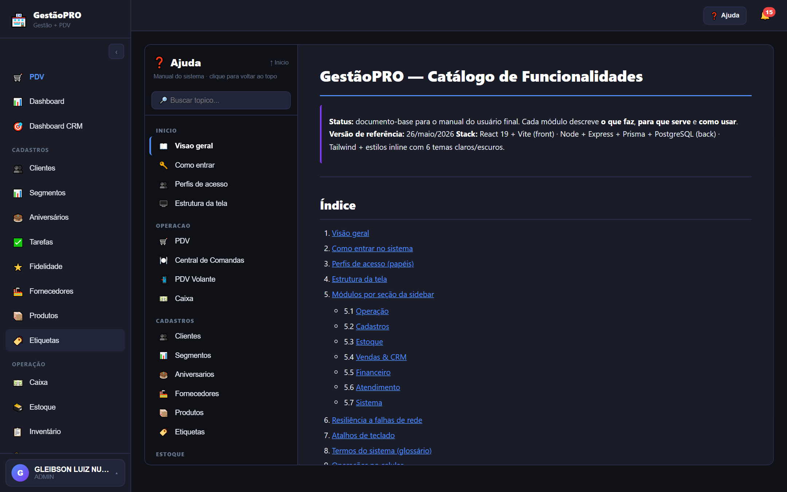

O próprio sistema embute este manual numa tela de **Ajuda** integrada — você não precisa abrir esse arquivo Markdown para consultá-lo no dia a dia.

### Onde encontrar

- **Sidebar → seção Sistema → ❓ Ajuda** — abre o manual completo com sumário lateral.
- **Botão ❓ Ajuda no topo da tela** (canto superior direito, ao lado do sino de alertas) — abre o manual **já posicionado no tópico relevante à tela que você está vendo**.

### Como funciona

A tela de Ajuda tem **2 colunas**:

```
┌─ Sumário ──────────┬──────── Conteúdo ──────────┐
│ 🔎 Buscar...       │  # GestãoProMax — Manual   │
│                    │                            │
│ INÍCIO             │  ## Módulo: PDV            │
│ • Visão geral      │                            │
│ • Como entrar      │  **O que faz:** registra…  │
│                    │                            │
│ OPERAÇÃO           │  **Como usar:**            │
│ • PDV         ←    │  1. Abrir o caixa…         │
│ • Comandas         │  2. Bipar produto…         │
│ • Caixa            │                            │
│ ...                │                            │
└────────────────────┴────────────────────────────┘
```

- **Coluna esquerda**: tópicos agrupados por seção (Início / Operação / Cadastros / Estoque / Vendas & CRM / Financeiro / Atendimento / Sistema / Referências). Clique em qualquer item para rolar até o tópico no conteúdo.
- **Busca**: digite no campo "🔎 Buscar tópico..." para filtrar os tópicos por nome (filtragem instantânea, sem recarregar).
- **Coluna direita**: conteúdo do manual renderizado com formatação completa (títulos, tabelas, listas, blocos de código, citações).

### Ajuda contextual

Sempre que você estiver dentro de uma tela específica (PDV, Caixa, Clientes, Financeiro, etc.) e clicar no botão **❓ Ajuda** do header, o manual abre **direto no tópico daquela tela**. Por exemplo:

- Está no PDV e clica ❓ → abre na seção "🛒 PDV — Ponto de Venda"
- Está em Caixa e clica ❓ → abre na seção "💵 Caixa"
- Está em Financeiro e clica ❓ → abre na seção "💰 Financeiro"

### Atualizações automáticas

O conteúdo da Ajuda **é o próprio arquivo `docs/MANUAL.md`** — não há duplicação. Quando o manual é atualizado, a tela reflete automaticamente na próxima vez que o sistema for buildado/publicado. Isso garante que a documentação que o usuário vê sempre bate com o sistema em produção.

---

## Anexo A — Fluxos completos (passo a passo)

### Fluxo 1: Atender um cliente no balcão

1. PDV → bipa os produtos.
2. (Opcional) seleciona cliente.
3. F10 → escolhe forma → confirma.
4. Imprime cupom e/ou envia no WhatsApp.

### Fluxo 2: Atender mesa em restaurante

1. PDV Volante (celular) → tipo MESA → digita nº da mesa.
2. Adiciona itens → "Enviar pedido".
3. Cozinha vê na Central de Comandas → ✓ Aceitar → preparar → 🔔 Pronto.
4. Garçom → 🍽 Servir.
5. Mesa pede a conta → 💰 Fechar venda → PDV pré-carrega → cobra → cupom.

### Fluxo 3: Entrada de mercadoria do fornecedor

1. Compras → + Nova compra → escolhe fornecedor.
2. Adiciona produtos com qtd e custo.
3. Marca "Gerar conta a pagar" → 3× → vencimento 30 dias.
4. Registrar → estoque sobe, 3 contas pendentes no Financeiro.

### Fluxo 4: Fechar o caixa no fim do dia

1. Caixa → conta o dinheiro físico.
2. Botão "Fechar caixa" → digita valor contado + troco para amanhã.
3. Vê diferença (sobra/quebra/zero).
4. Se VENDEDOR: pede senha do gerente.
5. Fechado → Histórico.

### Fluxo 5: Reativar cliente inativo

1. Aniversários/Reativação → aba Reativação.
2. Filtra "sem comprar há 90 dias".
3. Botão WhatsApp em cada linha → escolhe template "Reativação 90d".
4. Mensagem pré-preenchida abre no WhatsApp.

### Fluxo 6: Receber NPS de um cliente

1. Cliente faz uma compra (com cadastro vinculado).
2. NPS → aba Pendentes → encontra a venda.
3. Botão "Enviar WhatsApp" → manda o link único.
4. Cliente abre, dá nota, comenta.
5. NPS → aba Respondidas → resposta aparece no dashboard.

---

## Anexo B — Convenções visuais

**Paleta de cores (semântica):**

| Cor | Uso |
|-----|-----|
| 🔵 Azul (accent) | Ações primárias, links, KPIs neutros |
| 🟣 Roxo (purple) | Premium, VIP, autorização gerencial |
| 🟢 Verde (green) | Sucesso, entrada, ativo, pago |
| 🔴 Vermelho (red) | Erro, saída, atrasado, perigoso |
| 🟡 Amarelo (yellow) | Aviso, pendente, sangria |

**Ícones-padrão na sidebar:**

🛒 PDV · 📊 Dashboard · 🎯 CRM · 👥 Clientes · 🏭 Fornecedores · 📦 Produtos · 🏷️ Etiquetas · 💵 Caixa · 🗃️ Estoque · 📋 Inventário · 🛍️ Compras · 📝 Orçamentos · 🎯 Funil · ⚡ Automações · ⭐ NPS · 💰 Financeiro · 📑 Relatórios · 🏆 Comissões · 🍽️ Comandas · 💬 WhatsApp · 🧑‍💼 Funcionários · 🏢 Empresa · 🖨️ Impressora · 📋 Projeto · 📜 Logs · 💾 Backup · 🛡 Sistema · 🎨 Aparência

---

*Documento gerado em 26/maio/2026. Próxima revisão sugerida: trimestral, ou após releases que adicionem/removam módulos.*
